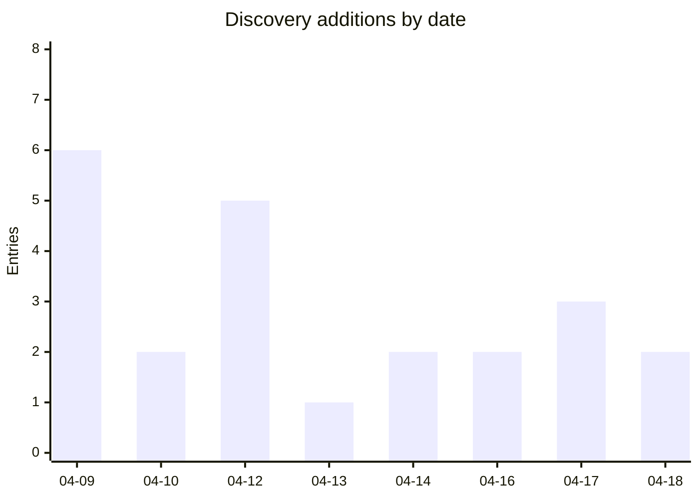

# Awesome Agent Sandboxes

A comprehensive guide to sandboxing options for AI agents — coding agents, browsing agents, automation agents, and general-purpose assistants.

Whether you're a developer building with AI agents or someone using them for personal tasks, this guide helps you understand how to keep your system safe while agents work on your behalf.

> **Living repo.** This landscape is moving fast. A daily automated discovery job posts newly found candidates as [open issues](https://github.com/msyvr/awesome-agent-sandboxes/issues?q=is%3Aopen+label%3Adiscovery) for review before they get added to the curated list. If you're looking for the bleeding edge, check those issues — but be aware they're unreviewed and discovery leans toward over-inclusion (rejection on review is common).

## Table of Contents

- [What is sandboxing and why should you care?](#sec-what-is-sandboxing)
- [Quick Start: sandbox your agent in 5 minutes](#sec-quick-start)
  - [If you're using Claude Code](#sec-qs-claude-code)
  - [If you're using OpenAI Codex](#sec-qs-codex)
  - [If you want stronger isolation](#sec-qs-stronger)
- [Choosing a sandbox](#sec-choosing)
  - [Safety & Alignment Research](#sec-safety-research)
- [Detailed Sandboxes Reference](#sec-detailed-reference)
- [Additions Over Time](#sec-additions)
- [Quick Triage](#sec-quick-triage)
- [Cloud Managed Sandboxes](#sec-cloud-managed)
- [Agent-Integrated Sandboxes](#sec-agent-integrated)
- [Standalone / Self-Hosted Tools](#sec-standalone)
- [Kubernetes-Native](#sec-kubernetes)
- [Development Environments](#sec-dev-environment)
- [Abstraction Layers](#sec-abstraction)
- [Building Blocks](#sec-building-blocks)
  - [VM & Container Runtimes](#sec-vm-runtime)
  - [OS-Level Sandboxing](#sec-os-primitive)
  - [WebAssembly Runtimes](#sec-wasm-runtime)
- [References](#sec-references)
- [Contributing](#sec-contributing)

<a id="sec-what-is-sandboxing"></a>
## What is sandboxing and why should you care?

A sandbox limits what your AI agent can do on your computer (or in the cloud). Think of it like giving someone access to one room in your house instead of handing them the keys to the whole building.

Without a sandbox, an AI agent typically has the same access you do: it can read and modify any of your files, make network requests, install software, and run arbitrary commands. Most of the time that's fine. But when things go wrong, they can go wrong fast:

- **Deleted or overwritten files** — an agent misinterprets an instruction and removes important data
- **Leaked credentials** — API keys, tokens, or passwords in environment variables get sent to external services
- **Unwanted network requests** — the agent reaches out to URLs you didn't expect, exfiltrating data or triggering costs
- **Runaway cloud bills** — an agent spins up resources or makes API calls in a loop
- **Supply chain attacks** — the agent installs a malicious package that compromises your system

A sandbox constrains these risks by enforcing boundaries the agent can't cross, no matter what instructions it follows.

### Sandboxing is not all-or-nothing

Different sandboxes protect against different things. Understanding what a sandbox *does and doesn't* cover helps you choose the right one:

- **Filesystem isolation** prevents the agent from reading or writing files outside a designated area. Most sandboxes offer this.
- **Network isolation** controls what the agent can reach over the network. Some sandboxes block all network access; others use allowlists.
- **Credential isolation** keeps API keys, tokens, and secrets out of the sandbox entirely. Few sandboxes do this — most rely on you to not pass secrets in.
- **Rollback** lets you undo what the agent did if something goes wrong. Very few sandboxes offer this.
- **Audit** records what the agent actually did, with cryptographic proof. This is rare but valuable for understanding incidents.

When evaluating a sandbox, ask: *what specific risks does this protect against, and what does it leave exposed?*

### Sandboxing alone isn't enough

A sandbox limits what your agent does, but it doesn't address every risk an agent introduces. Defense in depth means combining a sandbox with other tools that cover different threats:

- **Supply chain defense** — protect against malicious dependencies an agent might install. Tools like [pmg](https://github.com/safedep/pmg) intercept package installs (`npm`, `pip`, `uv`, etc.), check packages against threat intel, and run install scripts inside their own OS-level sandboxes.
- **Credential brokers** — give agents temporary, scoped access to services like Google Drive or AWS without handing over real credentials. Tools like [extrasuite](https://github.com/think41/extrasuite) provision per-user service accounts so an agent only sees explicitly shared resources.
- **Secret encryption** — prevent agents from reading secrets out of `.env` files on disk. Tools like [cloak](https://github.com/danieltamas/cloak) encrypt secrets into an AES-256-GCM vault and replace them with structurally valid fakes, gating decryption behind Touch ID or password auth.
- **Egress monitoring** — observe and audit what an agent reaches over the network, even within an allowlist. Useful for catching unexpected behavior before it becomes a problem.
- **Action verification** — cryptographic proof of what an agent actually did. Tools like [signet](https://github.com/Prismer-AI/signet) provide Ed25519-signed action receipts with hash-chained audit logs, so you can verify and replay agent actions after the fact.

These complement a sandbox; they don't replace it. This guide focuses on sandboxes themselves, but if you're building a serious defense posture, look at the layers above and below.

<a id="sec-quick-start"></a>
## Quick Start: sandbox your agent in 5 minutes

The fastest path to protection depends on what agent you're using and what OS you're on. Each option below includes what it protects and what it doesn't.

<a id="sec-qs-claude-code"></a>
### If you're using Claude Code

Claude Code has built-in sandboxing enabled by default. It uses OS-level primitives (bubblewrap on Linux, Seatbelt on macOS) to restrict filesystem and network access.

```bash
# Sandboxing is on by default — no setup needed.
# To verify, check that you haven't set dangerouslyDisableSandbox.
```

**Protects against:** Filesystem writes outside your project directory. Unrestricted network access (proxy-based domain allowlisting).

**Known risks:**
- The `dangerouslyDisableSandbox` flag can be triggered by the agent itself — a demonstrated escape vector (Ona, March 2026)
- macOS sandbox-exec is deprecated by Apple — could break in a future macOS update with no announced replacement
- Process-level isolation (shared kernel) — weaker than VM or container isolation. A kernel exploit could bypass it.

<a id="sec-qs-codex"></a>
### If you're using OpenAI Codex

Codex enables sandboxing by default in both cloud and local modes.

- **Cloud mode**: Code runs in an isolated container. Network access is disabled during the agent phase.
- **Local CLI (Linux)**: Uses Landlock + seccomp to restrict the agent to workspace-only writes.

**Protects against:** Filesystem access outside workspace. Network access during execution (cloud mode).

**Known risks:**
- Cloud mode requires GitHub integration — your code is sent to OpenAI's infrastructure
- Local mode is Linux-only (kernel 5.13+) — no macOS or Windows support
- Container isolation (cloud) shares the host kernel

<a id="sec-qs-stronger"></a>
### If you want stronger isolation

The options below provide deeper isolation than built-in agent sandboxing. They're listed in order of what security properties they offer, not brand recognition.

#### nono — kernel-enforced sandbox with credential proxy and audit (macOS, Linux, WSL2)

[nono](https://nono.sh) is the only sandbox that combines kernel enforcement with credential isolation, atomic rollback, and a cryptographic audit chain. Your API keys never enter the sandbox — nono proxies them at the network layer so the agent can use services without seeing credentials.

```bash
brew install nono
nono run -- claude
```

**Protects against:** Filesystem and network access (kernel-enforced). Credential leakage (keys never enter sandbox). Unrecoverable mistakes (atomic rollback). "What happened?" questions (cryptographic audit chain with Sigstore attestation).

**Known risks:**
- Early alpha — not yet security-audited
- Relatively new project, though very actively developed

#### Docker Sandboxes — microVM isolation for multiple agents (macOS, Linux)

[Docker Sandboxes](https://docs.docker.com/ai/sandboxes/) run your agent inside a dedicated microVM with its own Docker daemon, filesystem, and network. Stronger isolation boundary than process-level sandboxing.

```bash
# Requires Docker Desktop 4.58+ (or Docker Engine 29.1.5+)
docker sandbox run --image ubuntu:latest
```

Works with Claude Code, Codex, Copilot, Gemini, and Kiro.

**Protects against:** Filesystem and network access at the VM level. Cross-agent contamination (each sandbox is a separate microVM).

**Known risks:**
- **Experimental** (released March 2026) — not production-hardened, no security guarantees yet
- **Docker daemon attack surface**: Docker has a steady cadence of escape-class CVEs. CVE-2025-9074 (CVSS 9.3) allowed unauthenticated Docker Engine API access. Multiple runc CVEs in 2024-2025 enabled container escape. The daemon runs as root.
- **Isolation gap**: Docker Sandboxes isolate *where* code runs but not *what it's authorized to do*. An agent with an API key inside a sandbox can still merge PRs, delete production data, or exfiltrate via allowed network egress.
- **macOS nesting complexity**: On macOS, you get host → Apple VM → microVM → container → agent. Each layer adds potential attack surface and makes debugging harder.
- **Licensing**: Docker Desktop requires a paid subscription for organizations with >250 employees or >$10M annual revenue. Docker Engine (CLI only) remains free.

#### cleanroom (Buildkite) — microVM isolation with credential proxy (macOS, Linux)

[cleanroom](https://github.com/buildkite/cleanroom) runs your agent inside a Firecracker microVM (Linux) or Apple Virtualization.framework VM (macOS) with deny-by-default network egress and a host-side credential proxy — your API keys never enter the sandbox.

**Protects against:** Filesystem and network access at the VM level (hardware isolation boundary). Credential leakage (host-side proxy, keys never enter sandbox). Unauthorized egress (deny-by-default, policy-controlled allowlists via per-repo `cleanroom.yaml`).

**Known risks:**
- Early project, no LICENSE file in repo
- Newer than Docker Sandboxes, less community testing

#### Anthropic srt — sandbox any process or MCP server (macOS, Linux)

[srt](https://github.com/anthropic-experimental/sandbox-runtime) is a lightweight sandbox for arbitrary processes. Particularly useful for sandboxing MCP servers, which run with your permissions but are often third-party code.

```bash
npm install -g @anthropic-ai/sandbox-runtime
srt "your-command"
```

**Protects against:** Filesystem access outside allowed directories. Network access (proxy-based domain filtering with interactive approval — useful for discovering what a tool actually needs).

**Known risks:**
- Beta research preview — APIs may change
- Same macOS sandbox-exec deprecation risk as Claude Code
- Requires Node.js

#### microsandbox — local microVM isolation (macOS, Linux)

[microsandbox](https://github.com/zerocore-ai/microsandbox) provides microVM isolation using libkrun, with no external server. Your credentials and data never leave your machine.

**Protects against:** Full VM-level isolation. Data locality (nothing sent to cloud).

**Known risks:**
- Self-hosted — you're responsible for security updates
- Smaller community
- Requires KVM on Linux

#### Agent Safehouse — macOS sandbox profiles (macOS only)

[Agent Safehouse](https://github.com/eugene1g/agent-safehouse) generates macOS sandbox-exec profiles with a deny-first policy. Pre-built profiles for major coding agents, composable profile system, and a policy builder web tool.

```bash
brew install eugene1g/safehouse/agent-safehouse
```

**Protects against:** Filesystem and process access via macOS Seatbelt kernel enforcement.

**Known risks:**
- macOS only (permanently — sandbox-exec is Apple-specific)
- sandbox-exec deprecation risk
- No network proxy or credential isolation

#### Cloud sandbox services (any OS)

If you'd rather not manage infrastructure, sign up for a cloud sandbox:

- [E2B](https://e2b.dev) — Firecracker microVMs, ~150ms startup, free tier
- [Modal](https://modal.com/products/sandboxes) — GPU support, sub-second starts
- [Daytona](https://www.daytona.io) — container-based, state management (pause/resume)
- [Fly Sprites](https://sprites.dev) — persistent Firecracker microVMs with 100GB NVMe per sprite

**Protects against:** Full VM or container isolation. No local system access.

**Known risks:**
- Your code and data run on someone else's infrastructure
- Cloud-only — requires internet access
- Usage-based pricing can accumulate
- Ephemeral by default (except Daytona and Fly Sprites which offer persistence)

<a id="sec-choosing"></a>
## Choosing a sandbox

Use this decision tree to narrow down your options:

```
Do you already use an agent with built-in sandboxing?
├── Yes (Claude Code, Codex) → You have basic protection. Consider
│   stronger options below if you handle sensitive credentials or
│   need rollback/audit capabilities.
│
└── No → What matters most to you?
    │
    ├── Credential safety (API keys, tokens)
    │   ├── nono — keys never enter the sandbox + rollback + audit
    │   └── cleanroom — keys never enter the sandbox + microVM isolation
    │
    ├── Undo mistakes (rollback)
    │   └── nono — atomic rollback with integrity verification
    │
    ├── Strongest isolation boundary
    │   ├── Local → cleanroom, Docker Sandboxes, microsandbox, or sand (microVM)
    │   └── Cloud → E2B, Modal (Firecracker microVM)
    │
    ├── Sandbox MCP servers / third-party tools
    │   └── Anthropic srt — designed for this use case
    │
    ├── Simplest macOS setup
    │   └── Agent Safehouse (brew install, pre-built profiles)
    │
    ├── Cloud (don't want to manage infrastructure)
    │   ├── Need GPU? → Modal
    │   ├── Need persistence? → Fly Sprites or Daytona
    │   └── General purpose → E2B (most mature, free tier)
    │
    └── Kubernetes
        ├── On GKE? → GKE Agent Sandbox
        └── Any K8s cluster → agent-sandbox (kubernetes-sigs)
```

<a id="sec-safety-research"></a>
### Safety & Alignment Research

If you're doing AI safety research, RL training, capability evaluation, or adversarial red-teaming, see **[Sandboxing for AI Safety & Alignment Research](docs/safety-research.md)** — these contexts have fundamentally different containment requirements from general agent use.

---

_The sections below are generated from [`data/sandboxes.yaml`](data/sandboxes.yaml). They cover the full landscape: cloud services, standalone tools, VM runtimes, OS primitives, and WebAssembly runtimes._

<a id="sec-detailed-reference"></a>
## Detailed Sandboxes Reference

Full per-entry information for every sandbox lives in [docs/sandboxes-reference.md](docs/sandboxes-reference.md). The category tables below also link directly to relevant entries.

<a id="sec-additions"></a>
## Additions Over Time

Initial seed: **48 entries** (2026-04-07). Discovery additions since then:



<details>
<summary>Daily breakdown (click to expand)</summary>

**2026-04-18** (2 entries)
- [code-on-incus](docs/sandboxes-reference.md#ref-code-on-incus)
- [hazmat](docs/sandboxes-reference.md#ref-hazmat)

**2026-04-17** (3 entries)
- [brood-box](docs/sandboxes-reference.md#ref-brood-box)
- [alcless](docs/sandboxes-reference.md#ref-alcless)
- [hole](docs/sandboxes-reference.md#ref-hole)

**2026-04-16** (2 entries)
- [envpod-ce](docs/sandboxes-reference.md#ref-envpod-ce)
- [Superserve](docs/sandboxes-reference.md#ref-superserve)

**2026-04-14** (2 entries)
- [fence](docs/sandboxes-reference.md#ref-fence)
- [aide](docs/sandboxes-reference.md#ref-aide)

**2026-04-13** (1 entries)
- [llm-sandbox](docs/sandboxes-reference.md#ref-llm-sandbox)

**2026-04-12** (5 entries)
- [skilllite](docs/sandboxes-reference.md#ref-skilllite)
- [sandcastle](docs/sandboxes-reference.md#ref-sandcastle)
- [cleanroom](docs/sandboxes-reference.md#ref-cleanroom)
- [openkruise/agents](docs/sandboxes-reference.md#ref-openkruise-agents)
- [sandbox0](docs/sandboxes-reference.md#ref-sandbox0)

**2026-04-10** (2 entries)
- [sevorix-lite](docs/sandboxes-reference.md#ref-sevorix-lite)
- [treadstone](docs/sandboxes-reference.md#ref-treadstone)

**2026-04-09** (6 entries)
- [monty](docs/sandboxes-reference.md#ref-monty)
- [locki](docs/sandboxes-reference.md#ref-locki)
- [ai-sandbox-wrapper](docs/sandboxes-reference.md#ref-ai-sandbox-wrapper)
- [agentsh](docs/sandboxes-reference.md#ref-agentsh)
- [jailoc](docs/sandboxes-reference.md#ref-jailoc)
- [sand](docs/sandboxes-reference.md#ref-sand)

**2026-04-07** (48 entries) — initial seed
- [E2B](docs/sandboxes-reference.md#ref-e2b)
- [Daytona](docs/sandboxes-reference.md#ref-daytona)
- [Modal](docs/sandboxes-reference.md#ref-modal)
- [Runloop](docs/sandboxes-reference.md#ref-runloop)
- [Northflank](docs/sandboxes-reference.md#ref-northflank)
- [Fly Sprites](docs/sandboxes-reference.md#ref-fly-sprites)
- [CodeSandbox SDK](docs/sandboxes-reference.md#ref-codesandbox-sdk)
- [Bunnyshell AI Sandboxes](docs/sandboxes-reference.md#ref-bunnyshell-ai-sandboxes)
- [Vercel Sandbox](docs/sandboxes-reference.md#ref-vercel-sandbox)
- [Koyeb](docs/sandboxes-reference.md#ref-koyeb)
- [Cloudflare Dynamic Workers](docs/sandboxes-reference.md#ref-cloudflare-dynamic-workers)
- [Claude Code Sandbox](docs/sandboxes-reference.md#ref-claude-code-sandbox)
- [OpenAI Codex Sandbox](docs/sandboxes-reference.md#ref-openai-codex-sandbox)
- [Docker Sandboxes](docs/sandboxes-reference.md#ref-docker-sandboxes)
- [nono](docs/sandboxes-reference.md#ref-nono)
- [Anthropic sandbox-runtime (srt)](docs/sandboxes-reference.md#ref-anthropic-sandbox-runtime-srt)
- [NVIDIA OpenShell](docs/sandboxes-reference.md#ref-nvidia-openshell)
- [Agent Safehouse](docs/sandboxes-reference.md#ref-agent-safehouse)
- [scode](docs/sandboxes-reference.md#ref-scode)
- [microsandbox](docs/sandboxes-reference.md#ref-microsandbox)
- [agent-infra/sandbox](docs/sandboxes-reference.md#ref-agent-infra-sandbox)
- [Agent Sandbox (kubernetes-sigs)](docs/sandboxes-reference.md#ref-agent-sandbox-kubernetes-sigs)
- [GKE Agent Sandbox](docs/sandboxes-reference.md#ref-gke-agent-sandbox)
- [Ona (formerly Gitpod)](docs/sandboxes-reference.md#ref-ona-formerly-gitpod)
- [GitHub Codespaces](docs/sandboxes-reference.md#ref-github-codespaces)
- [Coder](docs/sandboxes-reference.md#ref-coder)
- [DevPod](docs/sandboxes-reference.md#ref-devpod)
- [ComputeSDK](docs/sandboxes-reference.md#ref-computesdk)
- [LangChain Sandboxes](docs/sandboxes-reference.md#ref-langchain-sandboxes)
- [OpenSandbox](docs/sandboxes-reference.md#ref-opensandbox)
- [NanoClaw](docs/sandboxes-reference.md#ref-nanoclaw)
- [Firecracker](docs/sandboxes-reference.md#ref-firecracker)
- [gVisor](docs/sandboxes-reference.md#ref-gvisor)
- [Kata Containers](docs/sandboxes-reference.md#ref-kata-containers)
- [libkrun](docs/sandboxes-reference.md#ref-libkrun)
- [Zeroboot](docs/sandboxes-reference.md#ref-zeroboot)
- [bubblewrap (bwrap)](docs/sandboxes-reference.md#ref-bubblewrap-bwrap)
- [macOS Seatbelt / sandbox-exec](docs/sandboxes-reference.md#ref-macos-seatbelt-sandbox-exec)
- [Firejail](docs/sandboxes-reference.md#ref-firejail)
- [Landlock LSM](docs/sandboxes-reference.md#ref-landlock-lsm)
- [seccomp-BPF](docs/sandboxes-reference.md#ref-seccomp-bpf)
- [Linux Namespaces + cgroups](docs/sandboxes-reference.md#ref-linux-namespaces-cgroups)
- [nsjail](docs/sandboxes-reference.md#ref-nsjail)
- [Wasmtime](docs/sandboxes-reference.md#ref-wasmtime)
- [WasmEdge](docs/sandboxes-reference.md#ref-wasmedge)
- [wasmCloud](docs/sandboxes-reference.md#ref-wasmcloud)
- [Wassette](docs/sandboxes-reference.md#ref-wassette)
- [Pyodide](docs/sandboxes-reference.md#ref-pyodide)

</details>

<a id="sec-quick-triage"></a>
## Quick Triage

Three views of the same landscape to help you find what fits.

### How strong is the isolation?

| Tier | Mechanism | Examples | Trade-off |
|------|-----------|----------|-----------|
| **Hardware VM (KVM)** | Full hardware virtualization with separate kernel per sandbox. | locki, brood-box, cleanroom, Firecracker, Kata Containers, +2 more | Higher overhead and resource use; requires KVM/hypervisor. |
| **MicroVM** | Lightweight VMs (e.g., Firecracker) with fast startup and low overhead. | E2B, Modal, Runloop, Northflank, Fly Sprites, +8 more | Slightly weaker than full VMs; Linux-only for most options. |
| **Container / User-space Kernel** | Shared kernel with namespace or syscall isolation (Docker, gVisor). | Daytona, Koyeb, OpenAI Codex Sandbox, agent-infra/sandbox, llm-sandbox, +18 more | Shared kernel means a kernel exploit can bypass isolation. |
| **Process-level** | OS-level restrictions on a process (namespaces, LSMs, Seatbelt). | Claude Code Sandbox, nono, Anthropic sandbox-runtime (srt), NVIDIA OpenShell, Agent Safehouse, +16 more | Weakest containment boundary; not for adversarial workloads. |
| **Wasm / Language Runtime** | WebAssembly or V8 isolate sandboxing. | Cloudflare Dynamic Workers, monty, Wasmtime, WasmEdge, wasmCloud, +2 more | Limited to specific runtimes; can't run arbitrary binaries. |

### How do I get started?

| Effort | What it means | Examples |
|--------|---------------|----------|
| **Zero-config** | Built into the agent — sandboxing is on by default with no setup. | Claude Code Sandbox, OpenAI Codex Sandbox |
| **Sign up for a service** | Create an account and use a cloud API/SDK. No local infrastructure. | E2B, Daytona, Modal, Runloop, Northflank, +11 more |
| **Install a tool** | Install a standalone tool or runtime on your machine. | Docker Sandboxes, nono, Anthropic sandbox-runtime (srt), NVIDIA OpenShell, Agent Safehouse, +32 more |
| **Compose building blocks** | Assemble from OS primitives or VM runtimes. Requires systems knowledge. | Firecracker, gVisor, Kata Containers, libkrun, Zeroboot, +11 more |

### Where does it run?

| Model | What it means | Examples |
|-------|---------------|----------|
| **Built into agent** | Sandboxing ships with the agent itself. | Claude Code Sandbox, OpenAI Codex Sandbox |
| **Cloud managed** | Runs on someone else's infrastructure. | E2B, Daytona, Modal, Runloop, Northflank, +11 more |
| **Local** | Runs on your machine, data stays local. | Docker Sandboxes, nono, Anthropic sandbox-runtime (srt), NVIDIA OpenShell, Agent Safehouse, +35 more |
| **Self-hosted** | You host and manage the infrastructure. | Coder, OpenSandbox, Firecracker, gVisor, Kata Containers, +3 more |
| **Kubernetes** | Runs on a Kubernetes cluster. | Agent Sandbox (kubernetes-sigs), GKE Agent Sandbox, treadstone, openkruise/agents, sandbox0 |

---

<a id="sec-cloud-managed"></a>
## Cloud Managed Sandboxes

Managed cloud services that provide sandbox environments via API/SDK. You sign up and get isolated environments on demand.

| Name | OSS? | Isolation | Notes |
|------|------|-----------|-------|
| [Bunnyshell AI Sandboxes](docs/sandboxes-reference.md#ref-bunnyshell-ai-sandboxes) | No | microvm | MCP server integration is notable — direct plugin for Claude Code, Cursor, and Windsurf. |
| [Cloudflare Dynamic Workers](docs/sandboxes-reference.md#ref-cloudflare-dynamic-workers) | No | v8-isolate | Unique edge-first approach using V8 isolates instead of containers/VMs. Credential injection without agent visibility is a strong security feature. Open beta early 2026. |
| [CodeSandbox SDK](docs/sandboxes-reference.md#ref-codesandbox-sdk) | No | microvm | Well-established brand from the browser IDE space, expanding to agent use. |
| [Daytona](docs/sandboxes-reference.md#ref-daytona) | Yes (Apache-2.0) | container | Pivoted from CDE space (Feb 2025). $31M Series A (Feb 2026). State management (pause/resume) is a key differentiator vs. ephemeral-only platforms. |
| [E2B](docs/sandboxes-reference.md#ref-e2b) | Yes (Apache-2.0) | microvm | One of the earliest and most widely adopted agent sandbox platforms. Docker MCP Catalog partnership. |
| [Fly Sprites](docs/sandboxes-reference.md#ref-fly-sprites) | No | microvm | Persistence is the key differentiator — most sandboxes are ephemeral. Checkpoint/restore enables warm resumption of long-running agent sessions. |
| [Modal](docs/sandboxes-reference.md#ref-modal) | No | microvm | Only major sandbox platform with GPU support — unique differentiator for ML/AI workloads that need compute. |
| [Northflank](docs/sandboxes-reference.md#ref-northflank) | No | kata, gvisor | BYOC option is unusual in this space — most cloud sandboxes are single-provider. Production-proven at scale (2M+ workloads/month). |
| [Runloop](docs/sandboxes-reference.md#ref-runloop) | No | microvm | Enterprise compliance focus (SOC 2) differentiates from developer-oriented alternatives. GA May 2025. |
| [Superserve](docs/sandboxes-reference.md#ref-superserve) | Yes (Apache-2.0) | microvm | Firecracker-based like E2B. SDK is open source (Apache-2.0) but the sandbox backend infrastructure is in a separate private repo. Beta — evaluate maturity before committing to production use. |
| [Vercel Sandbox](docs/sandboxes-reference.md#ref-vercel-sandbox) | No | microvm | Tightly integrated with Vercel deployment pipeline and v0. |

<a id="sec-agent-integrated"></a>
## Agent-Integrated Sandboxes

Sandboxing built directly into AI agent products. These activate automatically or with minimal configuration.

| Name | OSS? | Isolation | Notes |
|------|------|-----------|-------|
| [Claude Code Sandbox](docs/sandboxes-reference.md#ref-claude-code-sandbox) | No | user-namespace, seatbelt | Demonstrated escape by Ona (March 2026) via dangerouslyDisableSandbox flag. Uses bubblewrap on Linux, Seatbelt on macOS — different mechanisms per OS. |
| [OpenAI Codex Sandbox](docs/sandboxes-reference.md#ref-openai-codex-sandbox) | No | container, landlock, seccomp | Only major agent with sandboxing enabled by default. Two-phase model (online setup, offline agent) is a unique security architecture — the agent never has network access during execution. |

<a id="sec-standalone"></a>
## Standalone / Self-Hosted Tools

Tools you install and run yourself to sandbox any agent or process on your own machine.

| Name | OSS? | Isolation | Notes |
|------|------|-----------|-------|
| [Agent Safehouse](docs/sandboxes-reference.md#ref-agent-safehouse) | Yes | seatbelt | More mature than it appears — has CI tests, docs site, and thoughtful profile composition. The most polished macOS-specific sandboxing option. |
| [agent-infra/sandbox](docs/sandboxes-reference.md#ref-agent-infra-sandbox) | Yes | container | Kitchen-sink approach — good for prototyping and development, less suitable for security-critical production use. |
| [agentsh](docs/sandboxes-reference.md#ref-agentsh) | Yes (Apache-2.0) | process, landlock, seatbelt | Real runtime enforcement, not just wrapping. The "redirect" policy decision is unusual — can transparently steer agent network calls or out-of-workspace writes to scratch dirs without the agent knowing it was redirected. |
| [ai-sandbox-wrapper](docs/sandboxes-reference.md#ref-ai-sandbox-wrapper) | Yes | container | Opinionated hardening over default Docker — capability dropping and Git fetch-only mode are substantive choices most Docker wrappers don't make. No license means the code is technically all-rights-reserved by default; consider asking the author to add one before relying on it. |
| [aide](docs/sandboxes-reference.md#ref-aide) | Yes (MIT) | seatbelt | The capability model is the differentiator — 19 built-in capabilities (docker, k8s, aws, etc.) with composable grants and never-allow hard denials. More opinionated than fence or Agent Safehouse about what agents should be allowed to do. Linux sandbox is planned but not yet implemented. |
| [alcless](docs/sandboxes-reference.md#ref-alcless) | Yes (Apache-2.0) | process | From AkihiroSuda (maintainer of Lima, nerdctl). Deliberately positioned as the lightweight complement to Lima (VM-based). Zero VM overhead — just Unix user separation. The rsync + confirm workflow means changes don't land on the host without approval. |
| [Anthropic sandbox-runtime (srt)](docs/sandboxes-reference.md#ref-anthropic-sandbox-runtime-srt) | Yes | user-namespace, seatbelt | Designed to sandbox any process, not just Claude Code. Interactive network approval mode is useful for discovering what network access a tool actually needs. |
| [brood-box](docs/sandboxes-reference.md#ref-brood-box) | Yes (Apache-2.0) | kvm, microvm | From Stacklok (founded by Luke Hinds of Sigstore). Hardware VM isolation like cleanroom, but adds TOCTOU-resistant diff review — the VM is stopped before the user reviews changes, preventing the agent from modifying files during review. DNS egress firewall and non-overridable secret exclusions are strong default posture. |
| [cleanroom](docs/sandboxes-reference.md#ref-cleanroom) | Yes | microvm, kvm | From Buildkite (established CI company). Strongest isolation in recent discovery batches — hardware VM boundary, not containers or namespaces. Credential proxy model is similar to nono (keys never enter the sandbox). cleanroom.yaml per-repo policy is a clean declarative approach. |
| [code-on-incus](docs/sandboxes-reference.md#ref-code-on-incus) | Yes (MIT) | container, seccomp | Goes beyond isolation into active defense — the monitoring daemon uses kernel-level nftables packet inspection to detect reverse shells, C2 callbacks, DNS tunneling, and data exfiltration patterns, then auto-pauses or kills the container. Supply-chain hardening (read-only git hooks) is a detail most sandboxes miss. |
| [Docker Sandboxes](docs/sandboxes-reference.md#ref-docker-sandboxes) | No | microvm | Very new (March 2026). Multi-agent support is notable — works with most major coding agents out of the box. |
| [envpod-ce](docs/sandboxes-reference.md#ref-envpod-ce) | Yes (BSL-1.1) | user-namespace, seccomp | The diff/commit/rollback workflow is unique — agents work on real host files via an OverlayFS overlay, and changes are staged for human review before committing to the host. Most sandboxes either fully isolate (agent can't touch host files) or don't isolate at all. This is a middle ground that enables real work with reversibility. BSL-1.1 license restricts production use without a commercial license. |
| [fence](docs/sandboxes-reference.md#ref-fence) | Yes (Apache-2.0) | seatbelt, user-namespace | Lightest-weight option for wrapping agent processes with real isolation — no container runtime needed. Inspired by Anthropic's srt. Built-in agent templates mean zero config for common agents. Well-documented security model and architecture. |
| [hazmat](docs/sandboxes-reference.md#ref-hazmat) | Yes (MIT) | seatbelt, process | Strongest macOS-specific sandbox — layers everything alcless (user isolation) and Agent Safehouse (Seatbelt) do individually, plus pf firewall and DNS blocklists. TLA+ formal verification of session lifecycle is unusual rigor for a sandbox tool. Honest about limitations (HTTPS exfil, shared /tmp). |
| [hole](docs/sandboxes-reference.md#ref-hole) | Yes (Apache-2.0) | container | The --dump-network-access flag is useful for discovering what network access an agent actually needs — similar to Anthropic srt's interactive approval mode but post-hoc. Docker-in-Docker support is unusual and needed for agents that themselves use containers. |
| [jailoc](docs/sandboxes-reference.md#ref-jailoc) | Yes (MIT) | container | Backed by Seznam (Czech search engine). Network isolation via iptables allowlist prevents pivot to internal infra. The DinD sidecar approach avoids the common docker.sock mount escape vector. |
| [llm-sandbox](docs/sandboxes-reference.md#ref-llm-sandbox) | Yes (MIT) | container | Multi-backend support is the differentiator — same API across Docker, Podman, and K8s. Good for sandboxing LLM-generated code execution specifically. SonarCloud + codecov CI suggests reasonable code quality standards. |
| [locki](docs/sandboxes-reference.md#ref-locki) | Yes | kvm, container | One of the few sandboxes that layers VM (Lima/QEMU) plus container (Incus) for coding agents — interesting design worth tracking. Author is candid about "no security guarantees" in the README. No license means the code is technically all-rights-reserved by default; consider asking the author to add one before relying on it. |
| [microsandbox](docs/sandboxes-reference.md#ref-microsandbox) | Yes | microvm | Local-first is the key differentiator — no credentials leave your machine. Good for privacy-conscious users handling sensitive API keys. |
| [monty](docs/sandboxes-reference.md#ref-monty) | Yes (MIT) | process | Different approach from Pyodide — a custom Rust interpreter rather than CPython compiled to Wasm. Will power Pydantic AI's codemode feature. Backed by Pydantic, but explicitly experimental. Categorized in the wasm tier because language-runtime sandboxing fits the same isolation strength characterization (fastest/lightest, limited to specific runtimes), even though it's not actually Wasm. |
| [nono](docs/sandboxes-reference.md#ref-nono) | Yes | landlock, seatbelt | Unique combination of properties no other tool offers: credential proxy (API keys never enter the sandbox), attestation, and atomic rollback. Easy setup (brew install, then nono run -- claude). Very active development. |
| [NVIDIA OpenShell](docs/sandboxes-reference.md#ref-nvidia-openshell) | Yes (Apache-2.0) | landlock, seccomp | NVIDIA backing gives visibility. OPA/Rego policy support targets enterprise governance workflows. Announced at GTC 2026. |
| [OpenSandbox](docs/sandboxes-reference.md#ref-opensandbox) | Yes | container | Broadest scope of any sandbox — covers evaluation and RL training environments, not just agent sandboxing. |
| [sand](docs/sandboxes-reference.md#ref-sand) | Yes (Apache-2.0) | microvm | Apple Containerization gives hardware-isolated micro-VMs (Kata-based) on Apple Silicon. APFS clonefile makes workspace clones instant without copying files. eBPF egress filtering is a notable hardening choice for a solo project. |
| [sandcastle](docs/sandboxes-reference.md#ref-sandcastle) | Yes (MIT) | container | Uses Docker containers it creates directly — not delegating to E2B or Daytona. The git branch strategy (agents work on branches, commits merge back) is the differentiator. Useful if you want multi-agent orchestration with isolation included. |
| [scode](docs/sandboxes-reference.md#ref-scode) | Yes | process | Early entry in the space (Sept 2025), motivated by Claude Code's initial lack of built-in sandboxing. |
| [sevorix-lite](docs/sandboxes-reference.md#ref-sevorix-lite) | Yes (AGPL-3.0) | seccomp, user-namespace | Multi-layered runtime containment rather than VM/container isolation. The "Yellow Lane" human-in-the-loop model with countdown timer is unusual — the agent pauses pending human approval via dashboard. Claude Code support is built in, not bolted on. |
| [skilllite](docs/sandboxes-reference.md#ref-skilllite) | Yes (MIT) | seatbelt, user-namespace, seccomp | The skilllite-sandbox component is independently usable — you don't have to use the agent engine to get the sandbox. Three-layer defense model (install scan + pre-exec auth + runtime sandbox) is more depth than most standalone tools offer. |

<a id="sec-kubernetes"></a>
## Kubernetes-Native

Sandbox solutions designed for Kubernetes clusters.

| Name | OSS? | Isolation | Notes |
|------|------|-----------|-------|
| [Agent Sandbox (kubernetes-sigs)](docs/sandboxes-reference.md#ref-agent-sandbox-kubernetes-sigs) | Yes (Apache-2.0) | gvisor, kata | Official Kubernetes SIG project (launched KubeCon Atlanta Nov 2025). Likely to become the standard for K8s agent sandboxing. |
| [GKE Agent Sandbox](docs/sandboxes-reference.md#ref-gke-agent-sandbox) | No | gvisor, kata | Managed wrapper around the open-source agent-sandbox project. If you're already on GKE, this is the path of least resistance. |
| [openkruise/agents](docs/sandboxes-reference.md#ref-openkruise-agents) | Yes (Apache-2.0) | container | CNCF-affiliated via OpenKruise (Alibaba). The E2B API compatibility is notable — lets you use existing E2B SDK integrations against self-hosted K8s instead of E2B's cloud. Sandbox hibernation with GPU memory checkpoint is unusual. |
| [sandbox0](docs/sandboxes-reference.md#ref-sandbox0) | Yes (Apache-2.0) | container, gvisor | The procd process manager inside pods provides REPL session management — unusual for a K8s sandbox. Egress credential injection keeps secrets outside the sandbox boundary, similar to nono's credential proxy model but at the K8s level. |
| [treadstone](docs/sandboxes-reference.md#ref-treadstone) | Yes (Apache-2.0) | gvisor | Built on kubernetes-sigs/agent-sandbox as the underlying CRD. Browser handoff is an unusual feature — enables smooth transitions from autonomous agent execution to human intervention. Offered both as open source and as a hosted service. |

<a id="sec-dev-environment"></a>
## Development Environments

Development environment platforms that can be repurposed for agent isolation. These aren't agent-specific but provide usable isolation out of the box.

| Name | OSS? | Isolation | Notes |
|------|------|-----------|-------|
| [Coder](docs/sandboxes-reference.md#ref-coder) | Yes (AGPL-3.0) | container | Not agent-specific, but good for teams wanting self-hosted isolation without cloud dependency. AGPL license means modifications must be shared. |
| [DevPod](docs/sandboxes-reference.md#ref-devpod) | Yes | container | Not agent-specific. Good open-source alternative to Codespaces for local-first workflows where you want reproducible isolated environments. |
| [GitHub Codespaces](docs/sandboxes-reference.md#ref-github-codespaces) | No | container | Not purpose-built for agents, but accessible to anyone familiar with GitHub. A "good enough" isolation option for personal agent use without learning new tools. |
| [Koyeb](docs/sandboxes-reference.md#ref-koyeb) | No | container | General-purpose serverless platform, not purpose-built for agents, but usable for agent isolation out of the box with standard container workflows. |
| [Ona (formerly Gitpod)](docs/sandboxes-reference.md#ref-ona-formerly-gitpod) | No | container | Major pivot from Gitpod (rebranded Sept 2025). Demonstrated Claude Code sandbox escape (March 2026). Not agent-specific but increasingly agent-oriented. |

<a id="sec-abstraction"></a>
## Abstraction Layers

SDKs and frameworks that abstract across multiple sandbox providers.

| Name | OSS? | Isolation | Notes |
|------|------|-----------|-------|
| [ComputeSDK](docs/sandboxes-reference.md#ref-computesdk) | No | microvm, container | Useful if you want to avoid vendor lock-in. Isolation strength depends entirely on the chosen backend provider. |
| [LangChain Sandboxes](docs/sandboxes-reference.md#ref-langchain-sandboxes) | Yes | container | Only relevant if already using LangChain. The sandbox capabilities come from the underlying provider, not LangChain itself. |
| [NanoClaw](docs/sandboxes-reference.md#ref-nanoclaw) | Yes (MIT) | container | More of an agent orchestration framework with sandbox support than a sandbox itself. High adoption. Sandbox capability comes from Docker or Docker Sandboxes underneath. |

---

<a id="sec-building-blocks"></a>
## Building Blocks

The underlying technologies that sandbox products are built on. Most users interact with these indirectly — this section is for people building their own sandbox infrastructure or evaluating isolation claims.

<a id="sec-vm-runtime"></a>
### VM & Container Runtimes

The underlying VM and container runtimes that sandbox products are built on. Use these if you're building your own sandbox infrastructure.

| Name | OSS? | Isolation | Notes |
|------|------|-----------|-------|
| [Firecracker](docs/sandboxes-reference.md#ref-firecracker) | Yes (Apache-2.0) | kvm, microvm | The foundation most cloud sandbox platforms build on. Battle-tested at AWS scale (Lambda, Fargate). If you're building a sandbox product, this is likely your starting point. |
| [gVisor](docs/sandboxes-reference.md#ref-gvisor) | Yes (Apache-2.0) | gvisor | Used by GKE and kubernetes-sigs/agent-sandbox. Good middle ground between container and VM isolation — stronger than containers, lighter than full VMs. |
| [Kata Containers](docs/sandboxes-reference.md#ref-kata-containers) | Yes (Apache-2.0) | kata, kvm | Production-proven at scale via Northflank (2M+ workloads/month). Good for Kubernetes environments that need VM-level isolation per pod. |
| [libkrun](docs/sandboxes-reference.md#ref-libkrun) | Yes (Apache-2.0) | kvm | macOS support via Apple Virtualization.framework is unique among VM runtimes — Firecracker and Kata are Linux-only. Used by microsandbox. |
| [Zeroboot](docs/sandboxes-reference.md#ref-zeroboot) | Yes | kvm, microvm | 0.8ms sandbox creation via COW forking is remarkable if verified at scale. Worth watching as a potential next-gen approach to sandbox provisioning. |

<a id="sec-os-primitive"></a>
### OS-Level Sandboxing

OS-level isolation primitives. These are building blocks — most users interact with them indirectly through higher-level tools.

| Name | OSS? | Isolation | Notes |
|------|------|-----------|-------|
| [bubblewrap (bwrap)](docs/sandboxes-reference.md#ref-bubblewrap-bwrap) | Yes (LGPL-2.0+) | user-namespace | Years of hardening via Flatpak. Claude Code's Linux sandbox builds on this. The go-to unprivileged sandbox primitive on Linux. |
| [Firejail](docs/sandboxes-reference.md#ref-firejail) | Yes (GPL-2.0) | user-namespace, seccomp | Primarily for desktop app sandboxing, but applicable to agent processes. SUID requirement is a trade-off — convenience vs. attack surface. |
| [Landlock LSM](docs/sandboxes-reference.md#ref-landlock-lsm) | Yes (GPL-2.0) | landlock | The modern Linux answer to unprivileged sandboxing. Network support in kernel 6.7 makes it much more complete. Used by Codex CLI and OpenShell. |
| [Linux Namespaces + cgroups](docs/sandboxes-reference.md#ref-linux-namespaces-cgroups) | Yes (GPL-2.0) | user-namespace | Everything in the container and VM space builds on these primitives. Understanding namespaces and cgroups is foundational to evaluating any Linux-based sandbox's isolation claims. |
| [macOS Seatbelt / sandbox-exec](docs/sandboxes-reference.md#ref-macos-seatbelt-sandbox-exec) | No | seatbelt | Deprecated but still the only game in town for macOS process sandboxing. Used by Claude Code, Agent Safehouse, and srt on macOS. No replacement announced by Apple. |
| [nsjail](docs/sandboxes-reference.md#ref-nsjail) | Yes (Apache-2.0) | user-namespace, seccomp | Google-maintained. Kafel policy language is more ergonomic than raw seccomp-BPF. Used by competitive programming judges for untrusted code execution. |
| [seccomp-BPF](docs/sandboxes-reference.md#ref-seccomp-bpf) | Yes (GPL-2.0) | seccomp | Building block, not standalone. Almost always used alongside Landlock or namespaces to provide full sandbox coverage. |

<a id="sec-wasm-runtime"></a>
### WebAssembly Runtimes

WebAssembly runtimes providing language-level sandboxing. Architecturally elegant but require compiling tools to Wasm.

| Name | OSS? | Isolation | Notes |
|------|------|-----------|-------|
| [Pyodide](docs/sandboxes-reference.md#ref-pyodide) | Yes (MPL-2.0) | wasm | Good for sandboxing Python-only agent code execution where you need browser-grade isolation guarantees without running a VM. |
| [wasmCloud](docs/sandboxes-reference.md#ref-wasmcloud) | Yes (Apache-2.0) | wasm | Higher-level than Wasmtime or WasmEdge — it's an application platform, not just a runtime. Useful if building distributed agent systems with Wasm isolation. |
| [WasmEdge](docs/sandboxes-reference.md#ref-wasmedge) | Yes (Apache-2.0) | wasm | CNCF project. Differentiates from Wasmtime with AI/ML inference extensions and edge deployment focus. |
| [Wasmtime](docs/sandboxes-reference.md#ref-wasmtime) | Yes (Apache-2.0) | wasm | The reference Wasm runtime from Bytecode Alliance. Architecturally elegant sandboxing but requires toolchain buy-in — you can't run arbitrary binaries. |
| [Wassette](docs/sandboxes-reference.md#ref-wassette) | Yes | wasm | Interesting intersection of MCP and Wasm — agents discover and load sandboxed tools via MCP from OCI registries. Microsoft backing. Released Aug 2025. |

<a id="sec-references"></a>
## References

See [references/reading-list.md](references/reading-list.md) for blog posts, papers, and discussions on agent sandboxing.

<a id="sec-contributing"></a>
## Contributing

To add or update a sandbox entry:

1. Edit `data/sandboxes.yaml` — follow the existing schema (all fields documented in the file header)
2. Run `python scripts/generate_readme.py` to regenerate the README
3. Open a PR

The generate script validates the YAML schema and will fail fast on missing required fields or invalid vocabulary values.

