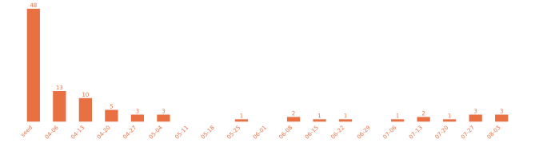

# awesome agent sandboxes

A comprehensive guide to sandboxing options for AI agents — coding agents, browsing agents, automation agents, and general-purpose assistants.

Whether you're a developer building with AI agents or someone using them for personal tasks, this guide helps you understand how to keep your system safe while agents work on your behalf.

> **Living repo.** This landscape is moving fast. A weekly automated discovery job posts newly found candidates as [open issues](https://github.com/msyvr/awesome-agent-sandboxes/issues?q=is%3Aopen+label%3Adiscovery) for review before they get added to the curated list. If you're looking for the bleeding edge, check those issues — but be aware they're unreviewed and discovery leans toward over-inclusion (rejection on review is common).

> **Browse interactively.** The full list is also a [filterable, sortable table](https://msyvr.github.io/awesome-agent-sandboxes/) — filter by isolation tier, adoption effort, and deployment model to answer questions like "self-hosted microVM options I can just install."

<p align="center"></p>

<details>
<summary>Weekly breakdown (click to expand)</summary>

**Week of 2026-08-31** (14 entries)
- [Dormice](#sec-self-hosted-platform)
- [vetto](#sec-standalone)
- [Beam](#sec-cloud-managed)
- [Blaxel](#sec-cloud-managed)
- [Box (ascii.dev)](#sec-cloud-managed)
- [Declaw](#sec-cloud-managed)
- [Freestyle](#sec-cloud-managed)
- [InstaVM](#sec-cloud-managed)
- [Islo](#sec-cloud-managed)
- [Leap0](#sec-cloud-managed)
- [Morph Cloud](#sec-cloud-managed)
- [Novita Sandbox](#sec-cloud-managed)
- [OmniRun](#sec-cloud-managed)
- [Tensorlake](#sec-cloud-managed)

**Week of 2026-08-24** (1 entry)
- [OneCLI](#sec-agent-integrated)

**Week of 2026-08-17** (3 entries)
- [clampdown](#sec-standalone)
- [cocoon sandbox](#sec-self-hosted-platform)
- [clawker](#sec-standalone)

**Week of 2026-08-10** (28 entries)
- [smolvm](#sec-standalone)
- [SmolVM (Celesto)](#sec-standalone)
- [boxlite](#sec-standalone)
- [shuru](#sec-standalone)
- [arcbox](#sec-dev-environment)
- [vibe](#sec-standalone)
- [matchlock](#sec-standalone)
- [chamber](#sec-standalone)
- [Cloud Hypervisor](#sec-vm-runtime)
- [landrun](#sec-standalone)
- [sandlock](#sec-standalone)
- [ai-jail](#sec-standalone)
- [Leash](#sec-standalone)
- [agent-sandbox.nix](#sec-standalone)
- [agentbox](#sec-standalone)
- [mcp-runner](#sec-standalone)
- [Kilntainers](#sec-abstraction)
- [forkd](#sec-self-hosted-platform)
- [AgentENV](#sec-self-hosted-platform)
- [k7](#sec-self-hosted-platform)
- [Arrakis](#sec-self-hosted-platform)
- [Judge0](#sec-self-hosted-platform)
- [netclode](#sec-kubernetes)
- [k8e](#sec-kubernetes)
- [Capsule](#sec-wasm-runtime)
- [Eryx](#sec-wasm-runtime)
- [Amla Sandbox](#sec-wasm-runtime)
- [Alibaba Cloud AgentBay](#sec-cloud-managed)

**Week of 2026-08-03** (3 entries)
- [cplt](#sec-standalone)
- [gbash](#sec-standalone)
- [axern](#sec-standalone)

**Week of 2026-07-27** (3 entries)
- [temps](#sec-standalone)
- [Tencent Cloud Agent Sandbox (AGS)](#sec-cloud-managed)
- [CubeSandbox](#sec-self-hosted-platform)

**Week of 2026-07-20** (1 entry)
- [hull](#sec-standalone)

**Week of 2026-07-13** (2 entries)
- [bx-mac](#sec-standalone)
- [agent-glovebox](#sec-standalone)

**Week of 2026-07-06** (1 entry)
- [mitos](#sec-kubernetes)

**Week of 2026-06-22** (1 entry)
- [klangk](#sec-dev-environment)

**Week of 2026-06-15** (1 entry)
- [warren](#sec-self-hosted-platform)

**Week of 2026-06-08** (2 entries)
- [Containarium](#sec-self-hosted-platform)
- [sandcat](#sec-dev-environment)

**Week of 2026-05-25** (1 entry)
- [DAM](#sec-kubernetes)

**Week of 2026-05-04** (3 entries)
- [loop](#sec-agent-integrated)
- [agentbox-sdk](#sec-abstraction)
- [agent_sandbox](#sec-standalone)

**Week of 2026-04-27** (3 entries)
- [pi-sandbox](#sec-agent-integrated)
- [LINCE](#sec-standalone)
- [pixels](#sec-standalone)

**Week of 2026-04-20** (5 entries)
- [AgentScope Runtime](#sec-abstraction)
- [gondolin](#sec-standalone)
- [EdgeBox](#sec-standalone)
- [gocker](#sec-standalone)
- [cua](#sec-standalone)

**Week of 2026-04-13** (10 entries)
- [llm-sandbox](#sec-standalone)
- [fence](#sec-standalone)
- [aide](#sec-standalone)
- [envpod-ce](#sec-standalone)
- [Superserve](#sec-cloud-managed)
- [brood-box](#sec-standalone)
- [alcless](#sec-standalone)
- [hole](#sec-standalone)
- [code-on-incus](#sec-standalone)
- [hazmat](#sec-standalone)

**Week of 2026-04-06** (13 entries)
- [monty](#sec-standalone)
- [locki](#sec-standalone)
- [ai-sandbox-wrapper](#sec-standalone)
- [agentsh](#sec-standalone)
- [jailoc](#sec-standalone)
- [sand](#sec-standalone)
- [sevorix-lite](#sec-standalone)
- [treadstone](#sec-kubernetes)
- [skilllite](#sec-standalone)
- [sandcastle](#sec-standalone)
- [cleanroom](#sec-standalone)
- [openkruise/agents](#sec-kubernetes)
- [sandbox0](#sec-kubernetes)

**Initial seed** (2026-04-07, 48 entries — the "seed" bar in the chart)
- [E2B](#sec-cloud-managed)
- [Daytona](#sec-cloud-managed)
- [Modal](#sec-cloud-managed)
- [Runloop](#sec-cloud-managed)
- [Northflank](#sec-cloud-managed)
- [Fly Sprites](#sec-cloud-managed)
- [CodeSandbox SDK](#sec-cloud-managed)
- [Bunnyshell AI Sandboxes](#sec-cloud-managed)
- [Vercel Sandbox](#sec-cloud-managed)
- [Koyeb](#sec-dev-environment)
- [Cloudflare Dynamic Workers](#sec-cloud-managed)
- [Claude Code Sandbox](#sec-agent-integrated)
- [OpenAI Codex Sandbox](#sec-agent-integrated)
- [Docker Sandboxes](#sec-standalone)
- [nono](#sec-standalone)
- [Anthropic sandbox-runtime (srt)](#sec-standalone)
- [NVIDIA OpenShell](#sec-standalone)
- [Agent Safehouse](#sec-standalone)
- [scode](#sec-standalone)
- [microsandbox](#sec-standalone)
- [agent-infra/sandbox](#sec-standalone)
- [Agent Sandbox (kubernetes-sigs)](#sec-kubernetes)
- [GKE Agent Sandbox](#sec-kubernetes)
- [Ona (formerly Gitpod)](#sec-dev-environment)
- [GitHub Codespaces](#sec-dev-environment)
- [Coder](#sec-dev-environment)
- [DevPod](#sec-dev-environment)
- [ComputeSDK](#sec-abstraction)
- [LangChain Sandboxes](#sec-abstraction)
- [OpenSandbox](#sec-self-hosted-platform)
- [NanoClaw](#sec-abstraction)
- [Firecracker](#sec-vm-runtime)
- [gVisor](#sec-vm-runtime)
- [Kata Containers](#sec-vm-runtime)
- [libkrun](#sec-vm-runtime)
- [Zeroboot](#sec-vm-runtime)
- [bubblewrap (bwrap)](#sec-os-primitive)
- [macOS Seatbelt / sandbox-exec](#sec-os-primitive)
- [Firejail](#sec-os-primitive)
- [Landlock LSM](#sec-os-primitive)
- [seccomp-BPF](#sec-os-primitive)
- [Linux Namespaces + cgroups](#sec-os-primitive)
- [nsjail](#sec-os-primitive)
- [Wasmtime](#sec-wasm-runtime)
- [WasmEdge](#sec-wasm-runtime)
- [wasmCloud](#sec-wasm-runtime)
- [Wassette](#sec-wasm-runtime)
- [Pyodide](#sec-wasm-runtime)

</details>

## Status — intermittently maintained (September 2026)

> **This repo is now maintained intermittently.** No guarantees on freshness — discovery has wound down from daily → weekly → occasional. The most recent additions are reflected in the **graph above** and its **Weekly breakdown** drop-down.

**Where did agent sandboxing land?** After ~140 curated entries and several months of discovery ([May strategy notes](docs/strategy-update-2026-05-05.md), [September update](docs/strategy-update-2026-09-03.md)), the answer isn't "everyone converged on one tool." The category split by tier:

- **Commodity isolation got absorbed into infrastructure.** "Run the agent in a box" stopped being a product. Frontier coding agents ship it built in — Claude Code (macOS Seatbelt + Linux bubblewrap), OpenAI Codex (Seatbelt/Landlock/seccomp). Cloud platforms turned it into a network primitive: [Cloudflare Sandboxes reached GA](https://blog.cloudflare.com/sandbox-ga/) in April 2026 ([InfoQ](https://www.infoq.com/news/2026/04/cloudflare-sandboxes-ga/)), and gateways like [Tailscale's Aperture](https://tailscale.com/blog/aperture-cli-AI-experimentation) now mediate agent credentials and config at the infrastructure layer rather than per-agent.
- **The cloud-sandbox vendor tier fragmented rather than consolidated.** No M&A among E2B / Daytona / Modal / Runloop (Daytona raised a $24M Series A in February 2026); each carved a niche — cold-start, price, GPU/ML, ecosystem lock-in. The [Superagent 2026 benchmark](https://www.superagent.sh/blog/ai-code-sandbox-benchmark-2026) frames the open question directly: do sandboxes stay a discrete primitive or get absorbed into the platforms above them?
- **What survives as a distinct, still-evolving category is opinionated security primitives** — credential isolation, audit chains *paired with real isolation*, threat detection, formal verification, and diff/commit/rollback governance — plus the macOS-without-Docker niche. That's what the curated list below is really about.
- **Regulation became a driver.** The EU AI Act's high-risk obligations [become enforceable August 2, 2026](https://www.artificialintelligence-news.com/news/agentic-ais-governance-challenges-under-the-eu-ai-act-in-2026/), demanding built-in audit logging and human oversight (Article 12) — spawning a wave of governance/audit-flavored orchestrators that layer compliance over commodity isolation. Useful for compliance; not sandboxes by this repo's definition.
- **Two forms firmed up over the summer of 2026.** Keeping credentials out of the sandbox by brokering them at a proxy went from a differentiator to a default — about a dozen entries added in August do it, hosted and local alike. And the microVM tier's headline number moved from boot time to forking a *running* sandbox, so parallel agent rollouts branch from a warm parent instead of booting cold. Details in the [September update](docs/strategy-update-2026-09-03.md).
- **Safety researchers reframed the box as one layer, not the mechanism.** Dangerous-capability evaluations now run inside sandboxes ([AISI's Inspect Sandboxing Toolkit](https://www.aisi.gov.uk/blog/the-inspect-sandboxing-toolkit-scalable-and-secure-ai-agent-evaluations)), but the field's [AI-control agenda](https://blog.redwoodresearch.org/p/guide) treats containment as one layer beneath monitoring and control protocols — because [escape benchmarks](https://arxiv.org/abs/2603.02277) show frontier models can break out of plain containers, and [agents can fingerprint their own evaluation environment](https://www.aisi.gov.uk/blog/what-can-sandboxed-ai-agents-learn-about-their-evaluation-environments) from inside the sandbox. See [docs/safety-research.md](docs/safety-research.md) for depth.

Full reasoning: strategy updates [2026-04-25](docs/strategy-update-2026-04-25.md) and [2026-05-05](docs/strategy-update-2026-05-05.md).

---

## Table of Contents

- [What is sandboxing and why should you care?](#sec-what-is-sandboxing)
- [Quick Start: sandbox your agent in 5 minutes](#sec-quick-start)
  - [If you're using Claude Code](#sec-qs-claude-code)
  - [If you're using OpenAI Codex](#sec-qs-codex)
  - [If you want stronger isolation](#sec-qs-stronger)
- [Choosing a sandbox](#sec-choosing)
  - [Safety & Alignment Research](#sec-safety-research)
- [Detailed Sandboxes Reference](#sec-detailed-reference)
  - [Quick Triage](#sec-quick-triage)
  - [Cloud Managed Sandboxes](#sec-cloud-managed)
  - [Agent-Integrated Sandboxes](#sec-agent-integrated)
  - [Standalone / Local Tools](#sec-standalone)
  - [Self-Hosted Sandbox Platforms](#sec-self-hosted-platform)
  - [Kubernetes-Native](#sec-kubernetes)
  - [Development Environments](#sec-dev-environment)
  - [Abstraction Layers](#sec-abstraction)
  - [Building Blocks](#sec-building-blocks)
    - [VM & Container Runtimes](#sec-vm-runtime)
    - [OS-Level Sandboxing](#sec-os-primitive)
    - [WebAssembly Runtimes](#sec-wasm-runtime)
- [References](#sec-references)
- [Contributing](#sec-contributing)

<a id="sec-what-is-sandboxing"></a>
## What is sandboxing and why should you care?

A sandbox limits what your AI agent can do on your computer (or in the cloud). Think of it like giving someone access to one room in your house instead of handing them the keys to the whole building.

Without a sandbox, an AI agent typically has the same access you do: it can read and modify any of your files, make network requests, install software, and run arbitrary commands. Most of the time that's fine. But when things go wrong, they can go wrong fast:

- **Deleted or overwritten files** — an agent misinterprets an instruction and removes important data
- **Leaked credentials** — API keys, tokens, or passwords in environment variables get sent to external services
- **Unwanted network requests** — the agent reaches out to URLs you didn't expect, exfiltrating data or triggering costs
- **Runaway cloud bills** — an agent spins up resources or makes API calls in a loop
- **Supply chain attacks** — the agent installs a malicious package that compromises your system

A sandbox constrains these risks by enforcing boundaries the agent can't cross, no matter what instructions it follows.

### Sandboxing is not all-or-nothing

Different sandboxes protect against different things. Understanding what a sandbox *does and doesn't* cover helps you choose the right one:

- **Filesystem isolation** prevents the agent from reading or writing files outside a designated area. Most sandboxes offer this.
- **Network isolation** controls what the agent can reach over the network. Some sandboxes block all network access; others use allowlists.
- **Credential isolation** keeps API keys, tokens, and secrets out of the sandbox entirely. Few sandboxes do this — most rely on you to not pass secrets in.
- **Rollback** lets you undo what the agent did if something goes wrong. Very few sandboxes offer this.
- **Audit** records what the agent actually did, with cryptographic proof. This is rare but valuable for understanding incidents.

When evaluating a sandbox, ask: *what specific risks does this protect against, and what does it leave exposed?*

### Sandboxing alone isn't enough

A sandbox limits what your agent does, but it doesn't address every risk an agent introduces. Defense in depth means combining a sandbox with other tools that cover different threats:

- **Supply chain defense** — protect against malicious dependencies an agent might install. Tools like [pmg](https://github.com/safedep/pmg) intercept package installs (`npm`, `pip`, `uv`, etc.), check packages against threat intel, and run install scripts inside their own OS-level sandboxes.
- **Credential brokers** — give agents temporary, scoped access to services like Google Drive or AWS without handing over real credentials. Tools like [extrasuite](https://github.com/think41/extrasuite) provision per-user service accounts so an agent only sees explicitly shared resources.
- **Secret encryption** — prevent agents from reading secrets out of `.env` files on disk. Tools like [cloak](https://github.com/danieltamas/cloak) encrypt secrets into an AES-256-GCM vault and replace them with structurally valid fakes, gating decryption behind Touch ID or password auth.
- **Credential proxying** — inject secrets at the network layer so agents never see them. [agent-vault](https://github.com/Infisical/agent-vault) (from Infisical) sits as an HTTP proxy between agents and APIs, transparently injecting credentials per-request. Works with any agent that speaks HTTP; SDKs for Docker, E2B, and Daytona environments.
- **Egress monitoring** — observe and audit what an agent reaches over the network, even within an allowlist. Useful for catching unexpected behavior before it becomes a problem.
- **Action verification** — cryptographic proof of what an agent actually did. Tools like [signet](https://github.com/Prismer-AI/signet) provide Ed25519-signed action receipts with hash-chained audit logs, so you can verify and replay agent actions after the fact.

These complement a sandbox; they don't replace it. This guide focuses on sandboxes themselves, but if you're building a serious defense posture, look at the layers above and below.

<a id="sec-quick-start"></a>
## Quick Start: sandbox your agent in 5 minutes

The fastest path to protection depends on what agent you're using and what OS you're on. Each option below includes what it protects and what it doesn't.

<a id="sec-qs-claude-code"></a>
### If you're using Claude Code

Claude Code has built-in sandboxing enabled by default. It uses OS-level primitives (bubblewrap on Linux, Seatbelt on macOS) to restrict filesystem and network access.

```bash
# Sandboxing is on by default — no setup needed.
# To verify, check that you haven't set dangerouslyDisableSandbox.
```

**Protects against:** Filesystem writes outside your project directory. Unrestricted network access (proxy-based domain allowlisting).

**Known risks:**
- The `dangerouslyDisableSandbox` flag can be triggered by the agent itself — a demonstrated escape vector (Ona, March 2026)
- macOS sandbox-exec is deprecated by Apple — could break in a future macOS update with no announced replacement
- Process-level isolation (shared kernel) — weaker than VM or container isolation. A kernel exploit could bypass it.

<a id="sec-qs-codex"></a>
### If you're using OpenAI Codex

Codex enables sandboxing by default in both cloud and local modes.

- **Cloud mode**: Code runs in an isolated container. Network access is disabled during the agent phase.
- **Local CLI (Linux)**: Uses Landlock + seccomp to restrict the agent to workspace-only writes.

**Protects against:** Filesystem access outside workspace. Network access during execution (cloud mode).

**Known risks:**
- Cloud mode requires GitHub integration — your code is sent to OpenAI's infrastructure
- Local mode is Linux-only (kernel 5.13+) — no macOS or Windows support
- Container isolation (cloud) shares the host kernel

<a id="sec-qs-stronger"></a>
### If you want stronger isolation

The options below provide deeper isolation than built-in agent sandboxing. They're listed in order of what security properties they offer, not brand recognition.

#### nono — kernel-enforced sandbox with credential proxy and audit (macOS, Linux, WSL2)

[nono](https://nono.sh) is the only sandbox that combines kernel enforcement with credential isolation, atomic rollback, and a cryptographic audit chain. Your API keys never enter the sandbox — nono proxies them at the network layer so the agent can use services without seeing credentials.

```bash
brew install nono
nono run -- claude
```

**Protects against:** Filesystem and network access (kernel-enforced). Credential leakage (keys never enter sandbox). Unrecoverable mistakes (atomic rollback). "What happened?" questions (cryptographic audit chain with Sigstore attestation).

**Known risks:**
- Early alpha — not yet security-audited
- Relatively new project, though very actively developed

#### Docker Sandboxes — microVM isolation for multiple agents (macOS, Linux)

[Docker Sandboxes](https://docs.docker.com/ai/sandboxes/) run your agent inside a dedicated microVM with its own Docker daemon, filesystem, and network. Stronger isolation boundary than process-level sandboxing.

```bash
# Requires Docker Desktop 4.58+ (or Docker Engine 29.1.5+)
docker sandbox run --image ubuntu:latest
```

Works with Claude Code, Codex, Copilot, Gemini, and Kiro.

**Protects against:** Filesystem and network access at the VM level. Cross-agent contamination (each sandbox is a separate microVM).

**Known risks:**
- **Experimental** (released March 2026) — not production-hardened, no security guarantees yet
- **Docker daemon attack surface**: Docker has a steady cadence of escape-class CVEs. CVE-2025-9074 (CVSS 9.3) allowed unauthenticated Docker Engine API access. Multiple runc CVEs in 2024-2025 enabled container escape. The daemon runs as root.
- **Isolation gap**: Docker Sandboxes isolate *where* code runs but not *what it's authorized to do*. An agent with an API key inside a sandbox can still merge PRs, delete production data, or exfiltrate via allowed network egress.
- **macOS nesting complexity**: On macOS, you get host → Apple VM → microVM → container → agent. Each layer adds potential attack surface and makes debugging harder.
- **Licensing**: Docker Desktop requires a paid subscription for organizations with >250 employees or >$10M annual revenue. Docker Engine (CLI only) remains free.

#### cleanroom (Buildkite) — microVM isolation with credential proxy (macOS, Linux)

[cleanroom](https://github.com/buildkite/cleanroom) runs your agent inside a Firecracker microVM (Linux) or Apple Virtualization.framework VM (macOS) with deny-by-default network egress and a host-side credential proxy — your API keys never enter the sandbox.

**Protects against:** Filesystem and network access at the VM level (hardware isolation boundary). Credential leakage (host-side proxy, keys never enter sandbox). Unauthorized egress (deny-by-default, policy-controlled allowlists via per-repo `cleanroom.yaml`).

**Known risks:**
- Early project, no LICENSE file in repo
- Newer than Docker Sandboxes, less community testing

#### Anthropic srt — sandbox any process or MCP server (macOS, Linux)

[srt](https://github.com/anthropic-experimental/sandbox-runtime) is a lightweight sandbox for arbitrary processes. Particularly useful for sandboxing MCP servers, which run with your permissions but are often third-party code.

```bash
npm install -g @anthropic-ai/sandbox-runtime
srt "your-command"
```

**Protects against:** Filesystem access outside allowed directories. Network access (proxy-based domain filtering with interactive approval — useful for discovering what a tool actually needs).

**Known risks:**
- Beta research preview — APIs may change
- Same macOS sandbox-exec deprecation risk as Claude Code
- Requires Node.js

#### microsandbox — local microVM isolation (macOS, Linux)

[microsandbox](https://github.com/superradcompany/microsandbox) provides microVM isolation using libkrun, with no external server. Your credentials and data never leave your machine.

**Protects against:** Full VM-level isolation. Data locality (nothing sent to cloud).

**Known risks:**
- Self-hosted — you're responsible for security updates
- Smaller community
- Requires KVM on Linux

#### Agent Safehouse — macOS sandbox profiles (macOS only)

[Agent Safehouse](https://github.com/eugene1g/agent-safehouse) generates macOS sandbox-exec profiles with a deny-first policy. Pre-built profiles for major coding agents, composable profile system, and a policy builder web tool.

```bash
brew install eugene1g/safehouse/agent-safehouse
```

**Protects against:** Filesystem and process access via macOS Seatbelt kernel enforcement.

**Known risks:**
- macOS only (permanently — sandbox-exec is Apple-specific)
- sandbox-exec deprecation risk
- No network proxy or credential isolation

#### Cloud sandbox services (any OS)

If you'd rather not manage infrastructure, sign up for a cloud sandbox:

- [E2B](https://e2b.dev) — Firecracker microVMs, ~150ms startup, free tier
- [Modal](https://modal.com/products/sandboxes) — GPU support, sub-second starts
- [Daytona](https://www.daytona.io) — container-based, state management (pause/resume)
- [Fly Sprites](https://sprites.dev) — persistent Firecracker microVMs with 100GB NVMe per sprite

**Protects against:** Full VM or container isolation. No local system access.

**Known risks:**
- Your code and data run on someone else's infrastructure
- Cloud-only — requires internet access
- Usage-based pricing can accumulate
- Ephemeral by default (except Daytona and Fly Sprites which offer persistence)

<a id="sec-choosing"></a>
## Choosing a sandbox

Use this decision tree to narrow down your options:

```
Do you already use an agent with built-in sandboxing?
├── Yes (Claude Code, Codex) → You have basic protection. Consider
│   stronger options below if you handle sensitive credentials or
│   need rollback/audit capabilities.
│
└── No → What matters most to you?
    │
    ├── Credential safety (API keys, tokens)
    │   ├── nono — keys never enter the sandbox + rollback + audit
    │   ├── cleanroom — keys never enter the sandbox + microVM isolation
    │   ├── matchlock — proxy-injected secrets + microVM, on your laptop
    │   ├── clampdown — agent holds a dummy key; container tier
    │   └── CubeSandbox — credential vault + microVM, self-hosted at scale
    │
    ├── Undo mistakes (rollback)
    │   ├── nono — atomic rollback with integrity verification
    │   └── CubeSandbox — copy-on-write snapshot, clone, and rollback
    │
    ├── Parallel runs (fork a *running* sandbox for tree search / RL)
    │   ├── forkd — Firecracker fork server, CoW children from a warm parent
    │   ├── smolvm — CoW fork of a live libkrun machine, single binary
    │   └── Morph Cloud — hosted memory+disk branching of a running VM
    │
    ├── Supervised execution (watch and halt a running agent)
    │   └── agent-glovebox — second-model monitor gates tool calls,
    │       phone notifications, remote halt, external audit log
    │
    ├── Team-governed agent policy (committed, auditable rules)
    │   └── cplt — version-controlled policy file; deny rules only
    │       tighten, loosening requires explicit sign-off
    │
    ├── Strongest isolation boundary
    │   ├── Local → cleanroom, Docker Sandboxes, microsandbox, or sand (microVM)
    │   └── Cloud → E2B, Modal (Firecracker microVM)
    │
    ├── Sandbox MCP servers / third-party tools
    │   └── Anthropic srt — designed for this use case
    │
    ├── Simplest macOS setup
    │   └── Agent Safehouse (brew install, pre-built profiles)
    │
    ├── Cloud (don't want to manage infrastructure)
    │   ├── Need GPU? → Modal
    │   ├── Need persistence? → Fly Sprites or Daytona
    │   └── General purpose → E2B (most mature, free tier)
    │
    ├── Serve sandboxes to your own users (API + control plane you run)
    │   ├── E2B-compatible API → CubeSandbox, Dormice, AgentENV, k8e
    │   ├── Bare metal, no Kubernetes → cocoon sandbox, k7, forkd
    │   └── Code execution for many languages → Judge0
    │
    └── Kubernetes
        ├── On GKE? → GKE Agent Sandbox
        └── Any K8s cluster → agent-sandbox (kubernetes-sigs)
```

<a id="sec-safety-research"></a>
### Safety & Alignment Research

If you're doing AI safety research, RL training, capability evaluation, or adversarial red-teaming, see **[Sandboxing for AI Safety & Alignment Research](docs/safety-research.md)** — these contexts have fundamentally different containment requirements from general agent use.

---

_The sections below are generated from [`data/sandboxes.yaml`](data/sandboxes.yaml). They cover the full landscape: cloud services, standalone tools, VM runtimes, OS primitives, and WebAssembly runtimes._

<a id="sec-detailed-reference"></a>
## Detailed Sandboxes Reference

The landscape at a glance, followed by per-category tables. Full per-entry details are in [`docs/`](docs/).

<a id="sec-quick-triage"></a>
### Quick Triage

Three views of the same landscape to help you find what fits.

#### How strong is the isolation?

| Tier | Mechanism | Examples | Trade-off |
|------|-----------|----------|-----------|
| **Hardware VM (KVM)** | Full hardware virtualization with separate kernel per sandbox. | Box (ascii.dev), Freestyle, Morph Cloud, Alibaba Cloud AgentBay, locki, +12 more | Higher overhead and resource use; requires KVM/hypervisor. |
| **MicroVM** | Lightweight VMs (e.g., Firecracker) with fast startup and low overhead. | E2B, Modal, Runloop, Northflank, Fly Sprites, +33 more | Slightly weaker than full VMs; Linux-only for most options. |
| **Container / User-space Kernel** | Shared kernel with namespace or syscall isolation (Docker, gVisor). | Daytona, Beam, OpenAI Codex Sandbox, OneCLI, agent-infra/sandbox, +38 more | Shared kernel means a kernel exploit can bypass isolation. |
| **Process-level** | OS-level restrictions on a process (namespaces, LSMs, Seatbelt). | Claude Code Sandbox, pi-sandbox, loop, nono, Anthropic sandbox-runtime (srt), +29 more | Weakest containment boundary; not for adversarial workloads. |
| **Wasm / Language Runtime** | WebAssembly or V8 isolate sandboxing. | Cloudflare Dynamic Workers, monty, gbash, Wasmtime, WasmEdge, +6 more | Limited to specific runtimes; can't run arbitrary binaries. |

#### How do I get started?

| Effort | What it means | Examples |
|--------|---------------|----------|
| **Zero-config** | Built into the agent — sandboxing is on by default with no setup. | Claude Code Sandbox, OpenAI Codex Sandbox |
| **Sign up for a service** | Create an account and use a cloud API/SDK. No local infrastructure. | E2B, Daytona, Modal, Runloop, Northflank, +25 more |
| **Install a tool** | Install a standalone tool or runtime on your machine. | pi-sandbox, loop, OneCLI, Docker Sandboxes, nono, +84 more |
| **Compose building blocks** | Assemble from OS primitives or VM runtimes. Requires systems knowledge. | axern, mcp-runner, k7, cocoon sandbox, netclode, +17 more |

#### Where does it run?

| Model | What it means | Examples |
|-------|---------------|----------|
| **Built into agent** | Sandboxing ships with the agent itself. | Claude Code Sandbox, OpenAI Codex Sandbox, pi-sandbox |
| **Cloud managed** | Runs on someone else's infrastructure. | E2B, Daytona, Modal, Runloop, Northflank, +27 more |
| **Local** | Runs on your machine, data stays local. | loop, Docker Sandboxes, nono, Anthropic sandbox-runtime (srt), NVIDIA OpenShell, +70 more |
| **Self-hosted** | You host and manage the infrastructure. | OneCLI, temps, axern, mcp-runner, OpenSandbox, +19 more |
| **Kubernetes** | Runs on a Kubernetes cluster. | Agent Sandbox (kubernetes-sigs), GKE Agent Sandbox, treadstone, openkruise/agents, sandbox0, +4 more |

---

<a id="sec-cloud-managed"></a>
### Cloud Managed Sandboxes

Managed cloud services that provide sandbox environments via API/SDK. You sign up and get isolated environments on demand.

| Name | OSS? | Isolation | Notes |
|------|------|-----------|-------|
| [Alibaba Cloud AgentBay](https://www.alibabacloud.com/product/agentbay) | No | kvm | Direct peer of Tencent Cloud Agent Sandbox (AGS), the only other managed offering with Android and Windows sandbox types; AgentBay's isolation is a full VM derived from Wuying cloud desktops rather than AGS's microVM engine. Unlike cua and pixels, the desktop VMs are hosted and billed per concurrent session license. SDK open-source (Apache-2.0, 1,147 stars, last push 2026-06); platform proprietary. Not to be confused with Alibaba Cloud's separate Kubernetes-based Agent Sandbox in Container Compute Service (ACS). |
| [Beam](https://www.beam.cloud/sandbox) | Yes (AGPL-3.0) | gvisor, container | Nearest to Modal (serverless functions plus sandboxes) but with an open-source, AGPL runtime you can run yourself, which Modal lacks; unlike E2B and Daytona the isolation is gVisor/runc containers rather than Firecracker microVMs. SOC 2 Type II is shown in the site footer; YC-backed; $30 free credit refreshed monthly. Blog posts state the gVisor+runc choice was made for lighter operation than microVMs. |
| [Blaxel](https://blaxel.ai) | No | microvm | Competes directly with E2B and Daytona; the differences are the memory-preserving standby (idle sandboxes cost storage only and resume with process state) and the multi-sandbox Agent Drive. Compliance claims on the homepage: SOC 2 Type II, HIPAA, ISO 27001. Named customers include Webflow, Strapi and Shortwave. YC-backed, San Francisco, founded 2024. SDK repositories were not checked; repo_url left null. |
| [Box (ascii.dev)](https://box.ascii.dev) | No | kvm | Full VMs like Freestyle and Fly Sprites, but the differentiators are a routable public IP per VM and a built-in desktop stream, which puts it partway toward cua and pixels (GUI desktop VMs) without their computer-use tooling. Forking is disk-level from a snapshot rather than the live-memory fork Freestyle advertises. Maturity is unproven: one product, no public SDK repositories checked, EU-only footprint. |
| [Bunnyshell AI Sandboxes](https://www.bunnyshell.com/ai-sandbox-environments/) | No | microvm | MCP server integration is notable — direct plugin for Claude Code, Cursor, and Windsurf. |
| [Cloudflare Dynamic Workers](https://developers.cloudflare.com/sandbox/) | No | v8-isolate | Unique edge-first approach using V8 isolates instead of containers/VMs. Credential injection without agent visibility is a strong security feature. Open beta early 2026. |
| [CodeSandbox SDK](https://codesandbox.io/sdk) | No | microvm | Well-established brand from the browser IDE space, expanding to agent use. |
| [Daytona](https://www.daytona.io) | Yes (Apache-2.0) | container | Pivoted from CDE space (Feb 2025). $31M Series A (Feb 2026). State management (pause/resume) is a key differentiator vs. ephemeral-only platforms. |
| [Declaw](https://declaw.ai) | No | microvm | The proxy-side secret injection resembles sandcat (Docker tier) and the credential proxy in nono, but Declaw pairs it with Firecracker isolation and moves the proxy off the guest entirely, adding TLS interception, PII redaction and a queryable audit trail. cagecheck, a static binary that reports escape vectors from inside any sandbox, is usable independently of the platform. All GitHub org repositories date from 2026; young vendor. |
| [E2B](https://e2b.dev) | Yes (Apache-2.0) | microvm | One of the earliest and most widely adopted agent sandbox platforms. Docker MCP Catalog partnership. |
| [Fly Sprites](https://sprites.dev) | No | microvm | Persistence is the key differentiator — most sandboxes are ephemeral. Checkpoint/restore enables warm resumption of long-running agent sessions. |
| [Freestyle](https://www.freestyle.sh) | No | kvm | Same shape as Fly Sprites and Box (full VMs rather than microVM sandboxes) but with two claims the others do not make: nested KVM inside the guest and forking a VM without pausing it. Compared with E2B the unit is a long-lived machine you hibernate, not an ephemeral sandbox. Customers named on the homepage include Onlook, Wordware and HeroUI; investors Floodgate, Y Combinator, Hustle Fund and Two Sigma Ventures. |
| [InstaVM](https://instavm.io) | No | microvm | Feature set overlaps Declaw (proxy-side secrets, default-deny egress, audit) and E2B (microVM sandboxes) but with fewer policy layers than Declaw and no BYOC option found. The same team publishes CodeRunner (github.com/instavm/coderunner, Apache-2.0), a local runner using Apple container on Apple Silicon macOS with an MCP server; that is the open-source part, the cloud platform is not. |
| [Islo](https://islo.dev) | No | microvm | Closest to nono and agent-glovebox in intent (credentials never reach the agent) but delivered as a hosted service: the gateway rewrites tokens at the network edge, whereas nono proxies from the host and Docker Sandboxes / E2B expose secrets as environment variables. Compared with E2B and Daytona, Islo bundles the orchestration layer (queues, webhooks, PR return) rather than only the sandbox API. Built by the Incredibuild team; the product page lists Incredibuild's enterprise customers, not Islo's. |
| [Leap0](https://leap0.dev) | No | microvm, kvm | Functionally the nearest hosted peer to E2B (Firecracker, Python/TS SDKs, snapshots), adding a firewall that injects credentials at the host like agent-glovebox's credential scoping, and a bundled desktop like cua and pixels. The jailer hardening statement (chroot, cgroup v2, seccomp, unique UID/GID) is more specific than most hosted vendors publish; it is the Firecracker Jailer's documented feature set and is stated by the vendor, not independently verified. SDKs, MCP server, and integrations are open-source (Apache-2.0) under github.com/leap0-dev; the platform is proprietary. |
| [Modal](https://modal.com/products/sandboxes) | No | microvm | Only major sandbox platform with GPU support — unique differentiator for ML/AI workloads that need compute. |
| [Morph Cloud](https://cloud.morph.so) | No | kvm | Differs from E2B, Daytona, and Modal in making memory-inclusive branching of a live VM the core primitive rather than a feature: the intended workflow is to fork one agent state into many and compare outcomes. Runloop and Fly Sprites offer snapshots but not documented fan-out of a running machine's memory. SDKs open-source (Apache-2.0); platform proprietary. |
| [Northflank](https://northflank.com) | No | kata, gvisor | BYOC option is unusual in this space — most cloud sandboxes are single-provider. Production-proven at scale (2M+ workloads/month). |
| [Novita Sandbox](https://novita.ai/sandbox) | No | microvm, kvm | Positioned like E2B (Firecracker, E2B-style SDK/CLI, templates) with two additions: an Agent Runtime deployment layer for framework agents and an open-source local edition (NovitaBox, Apache-2.0) that shares the SDK, a pairing similar to Tencent Cloud AGS with CubeSandbox. Free tier limits are 5 concurrent sandboxes, 1-hour sessions, 2 vCPU / 4 GB each. Provider press release is datelined San Francisco; the brief's "Asia-based" was not confirmed from public pages. |
| [OmniRun](https://omnirun.io) | No | microvm, kvm | Overlaps with Tensorlake as a Claude Managed Agents execution backend, but OmniRun's worker is the open-source piece (AGPL-3.0) and runs on the customer's own KVM host, while Tensorlake hosts the sandbox. Statelessness is a deliberate contrast with Morph Cloud and Leap0, whose snapshots carry state forward. Platform proprietary; SDKs (MIT) at github.com/a14a-org. |
| [Runloop](https://runloop.ai) | No | microvm | Enterprise compliance focus (SOC 2) differentiates from developer-oriented alternatives. GA May 2025. |
| [Superserve](https://github.com/superserve-ai/superserve) | Yes (Apache-2.0) | microvm | Firecracker-based like E2B. SDK is open source (Apache-2.0) but the sandbox backend infrastructure is in a separate private repo. Beta — evaluate maturity before committing to production use. |
| [Tencent Cloud Agent Sandbox (AGS)](https://cloud.tencent.com/product/ags) | No | microvm, kvm | The only cloud-managed entry offering managed Android and Windows sandboxes. Press coverage indicates the engine is Tencent's open-source CubeSandbox (also listed) — inferred, not stated on the product page. Samples at github.com/TencentCloudAgentRuntime/ags-cookbook. |
| [Tensorlake](https://tensorlake.ai) | No | microvm, kvm | Closest to Modal in scope (compute plus orchestration) and to E2B/Daytona in the sandbox API, with the Harbor eval integration and hosted Git as distinguishing pieces. SOC 2 Type II, HIPAA, EU data residency, and zero data retention are stated on the docs introduction. Backed by Redpoint and Amplify per the landing page; repo has 996 stars and daily commits at inclusion. Open-source components are the SDKs/CLI (Apache-2.0); platform proprietary. |
| [Vercel Sandbox](https://vercel.com) | No | microvm | Tightly integrated with Vercel deployment pipeline and v0. |

<a id="sec-agent-integrated"></a>
### Agent-Integrated Sandboxes

Sandboxing built directly into AI agent products. These activate automatically or with minimal configuration.

| Name | OSS? | Isolation | Notes |
|------|------|-----------|-------|
| [Claude Code Sandbox](https://code.claude.com/docs/en/sandboxing) | No | user-namespace, seatbelt | Demonstrated escape by Ona (March 2026) via dangerouslyDisableSandbox flag. Uses bubblewrap on Linux, Seatbelt on macOS — different mechanisms per OS. |
| [loop](https://github.com/radutopala/loop) | Yes (Apache-2.0) | container, seccomp | Differentiator vs commodity Docker-tier entries is the seccomp RET_USER_NOTIF + chat-routed HITL approval stack: kernel-parked traps resume only on SECCOMP_IOCTL_NOTIF_SEND with the CONTINUE flag, with path arguments read via process_vm_readv and symlink-resolved before the chat card is rendered. README credits agentsh for design inspiration; novel axis here is HITL governance via team chat rather than CLI prompts. ~11,500 LOC with a 1:1 test ratio despite low star count — code is production-grade on the security-critical paths. |
| [OneCLI](https://onecli.sh) | Yes (Apache-2.0) | container | OneCLI began as a Rust credential vault for agents and pivoted (v2) to a team platform; the company also sells a hosted version. Its credential-injecting egress gateway is the same mechanism as nono's credential proxy and agent-glovebox's credential scoping, applied at team scale with IdP provisioning and approvals. The isolation boundary is a hardened Docker container on an internal network, weaker than Docker Sandboxes' microVM or the microVM entries; the value is the policy and secrets plane rather than the sandbox itself. |
| [OpenAI Codex Sandbox](https://developers.openai.com/codex/concepts/sandboxing) | No | container, landlock, seccomp | Only major agent with sandboxing enabled by default. Two-phase model (online setup, offline agent) is a unique security architecture — the agent never has network access during execution. |
| [pi-sandbox](https://github.com/carderne/pi-sandbox) | Yes (MIT) | seatbelt, user-namespace | Thin agent-specific layer atop Anthropic sandbox-runtime, demonstrating that runtime as a reusable library for non-Anthropic agents. Differentiator over Claude Code's sandbox is the four-tier permission persistence with explicit asymmetric precedence between read and write rules. |

<a id="sec-standalone"></a>
### Standalone / Local Tools

Tools you install and run on your own machine to sandbox an agent or process: host-native kernel wrappers, local microVM launchers, and container wrappers.

| Name | OSS? | Isolation | Notes |
|------|------|-----------|-------|
| [Agent Safehouse](https://github.com/eugene1g/agent-safehouse) | Yes | seatbelt | More mature than it appears — has CI tests, docs site, and thoughtful profile composition. The most polished macOS-specific sandboxing option. |
| [agent-glovebox](https://github.com/AlexanderMattTurner/agent-glovebox) | Yes (Apache-2.0) | microvm | Clears the container-tier bar on three axes at once — per-repo credential scoping, second-model threat detection with human-in-the-loop halt, and an external tamper-evident audit trail — a combination none of the other Claude Code wrappers offer. Ships a written threat model and heavy security CI (gitleaks, grype, mutation testing), unusual at its size. |
| [agent-infra/sandbox](https://github.com/agent-infra/sandbox) | Yes | container | Kitchen-sink approach — good for prototyping and development, less suitable for security-critical production use. |
| [agent-sandbox.nix](https://github.com/archie-judd/agent-sandbox.nix) | Yes (MIT) | user-namespace, seatbelt | Same bwrap/Seatbelt plus domain-proxy shape as Anthropic sandbox-runtime srt, but expressed as Nix derivation arguments so the sandbox definition is reproducible and version-pinned with the agent binary itself. Specific to this entry are HTTP-method filtering per domain, read-only git metadata against hook injection, and the symlink-target check. The README's own similar-projects list names srt, jail.nix, jailed-agents, and ai-jail. About 150 GitHub stars at inclusion; sole maintainer, pushes in the week of review; v1.x renamed several arguments from v0.x. |
| [agent_sandbox](https://github.com/katosh/agent_sandbox) | Yes (MIT) | user-namespace, landlock, seccomp | Only sandbox surveyed with first-class HPC/Slurm awareness — the chaperon proxy intercepts Slurm submission and wraps job commands so an agent cannot escape by submitting an unsandboxed job to a compute node. Munge auth is deliberately blocked inside the sandbox so only the outside chaperon can submit. Bind-mount filesystem isolation returns ENOENT rather than EACCES, which sidesteps the ld-linux and /proc/self/root evasions that have hit Landlock-allowlist sandboxes. Ships with a 32 KB threat model and a documented pentest cycle. |
| [agentbox](https://agent-box.sh) | Yes (MIT) | container | Distinct from the listed agentbox-sdk. Nearest entries are Docker Sandboxes and agent-glovebox for the local Docker workflow, and the hosted E2B, Daytona, and Vercel Sandbox entries, which agentbox treats as interchangeable backends behind one CLI. The differentiator is the developer workflow around many parallel boxes (checkpoints, dashboard, IDE and VNC attach) and the host-side git relay with per-push approval, rather than a stronger isolation boundary. About 380 GitHub stars at inclusion; pushes on the day of review. |
| [agentsh](https://github.com/canyonroad/agentsh) | Yes (Apache-2.0) | process, landlock, seatbelt | Real runtime enforcement, not just wrapping. The "redirect" policy decision is unusual — can transparently steer agent network calls or out-of-workspace writes to scratch dirs without the agent knowing it was redirected. |
| [ai-jail](https://github.com/akitaonrails/ai-jail) | Yes (GPL-3.0-only) | user-namespace, landlock, seatbelt | Same bwrap-plus-Seatbelt base as Anthropic sandbox-runtime srt and fence, but ai-jail's distinguishing choices are a default private tmpfs home with credentials excluded unless requested, a monotonic project config that a repository cannot use to loosen policy, and secret masking for files inside the writable project tree. Unlike srt it has no domain proxy, so network is either off or unrestricted. About 1,180 GitHub stars at inclusion; maintained by Fabio Akita (akitaonrails) with pushes in the week of review. |
| [ai-sandbox-wrapper](https://github.com/nano-step/ai-sandbox-wrapper) | Yes | container | Opinionated hardening over default Docker — capability dropping and Git fetch-only mode are substantive choices most Docker wrappers don't make. No license means the code is technically all-rights-reserved by default; consider asking the author to add one before relying on it. |
| [aide](https://github.com/jskswamy/aide) | Yes (MIT) | seatbelt | The capability model is the differentiator — 19 built-in capabilities (docker, k8s, aws, etc.) with composable grants and never-allow hard denials. More opinionated than fence or Agent Safehouse about what agents should be allowed to do. Linux sandbox is planned but not yet implemented. |
| [alcless](https://github.com/AkihiroSuda/alcless) | Yes (Apache-2.0) | process | From AkihiroSuda (maintainer of Lima, nerdctl). Deliberately positioned as the lightweight complement to Lima (VM-based). Zero VM overhead — just Unix user separation. The rsync + confirm workflow means changes don't land on the host without approval. |
| [Anthropic sandbox-runtime (srt)](https://github.com/anthropic-experimental/sandbox-runtime) | Yes (Apache-2.0) | user-namespace, seatbelt | Designed to sandbox any process, not just Claude Code. Interactive network approval mode is useful for discovering what network access a tool actually needs. |
| [axern](https://github.com/cofy-x/axern) | Yes (Apache-2.0) | gvisor, container | The only self-hostable platform entry using gVisor as its untrusted-code boundary — the peers are plain-container (OpenSandbox, EdgeBox, agent-infra) or microVM (microsandbox). Included with strong maturity caveats: the scaffolding (docs site, three SDKs, Helm chart, governance files) far exceeds its public age, implying prior private development; sustainability unproven. |
| [boxlite](https://github.com/boxlite-ai/boxlite) | Yes (Apache-2.0) | microvm, kvm, seccomp | Nearest peer is microsandbox (libkrun, local-first): boxlite differs by running OCI images directly rather than a custom image format, by the seccomp/sandbox-exec wrapper around the VMM process, and by a five-language SDK surface. AgentScope Runtime (listed) ships a boxlite_client.py container backend, the main adoption signal at inclusion. Roughly 2.3k GitHub stars (2026-09). |
| [brood-box](https://github.com/stacklok/brood-box) | Yes (Apache-2.0) | kvm, microvm | From Stacklok (founded by Luke Hinds of Sigstore). Hardware VM isolation like cleanroom, but adds TOCTOU-resistant diff review — the VM is stopped before the user reviews changes, preventing the agent from modifying files during review. DNS egress firewall and non-overridable secret exclusions are strong default posture. |
| [bx-mac](https://github.com/holtwick/bx-mac) | Yes (MIT) | seatbelt | The only Seatbelt wrapper here that targets whole GUI IDEs rather than CLI agent processes. Weaker guarantee than the deny-first wrappers (fence, hazmat, jailoc, sand): the profile is a launch-time snapshot of $HOME with deny rules, and the README states plainly that this is protection against accidental or misguided file access, not airtight isolation. |
| [chamber](https://github.com/cirruslabs/chamber) | Yes (AGPL-3.0) | microvm | The only entry sandboxing an agent inside a macOS guest; vibe, shuru, arcbox, and matchlock all run Linux guests on the same Apple Virtualization.framework substrate. That matters for agents that need Xcode or other macOS-only toolchains. Cirrus Labs maintains Tart for CI, and chamber is a thin wrapper over it (45 GitHub stars at inclusion). Idle since 2025-12; treat as a reference design rather than an actively developed tool. |
| [clampdown](https://github.com/89luca89/clampdown) | Yes (GPL-3.0-only) | container, landlock, seccomp | Combines what agent-glovebox does with Docker and credential scoping and what nono does with Landlock plus a key proxy, and adds a layer neither has, which is OCI hooks and a sidecar supervisor that apply identical confinement to containers the agent itself spawns for builds and tests. That nested-container enforcement, the FROM scratch sidecar and proxy images, and the seccomp-notify exec allowlist are the distinguishing mechanisms. Written by Luca Di Maio (distrobox); pushes on the day of review. |
| [clawker](https://docs.clawker.dev) | Yes (AGPL-3.0-or-later) | container | Occupies the same Docker-wrapper slot as agent-glovebox and clampdown but inverts their emphasis by putting all enforcement at the network edge, with name-based rules matched at request time rather than IPs pinned in iptables (clampdown) and no kernel syscall filtering. The README's comparison table rates competitors including nono, Anthropic sandbox-runtime srt, and Docker Sandboxes, so treat its own column with the usual caution. Solo maintainer, about 50 GitHub stars at inclusion, pushes in the week of review; a Claude Code support plugin ships separately under MIT. |
| [cleanroom](https://github.com/buildkite/cleanroom) | Yes | microvm, kvm | From Buildkite (established CI company). Strongest isolation in recent discovery batches — hardware VM boundary, not containers or namespaces. Credential proxy model is similar to nono (keys never enter the sandbox). cleanroom.yaml per-repo policy is a clean declarative approach. |
| [code-on-incus](https://github.com/mensfeld/code-on-incus) | Yes (MIT) | container, seccomp | Goes beyond isolation into active defense — the monitoring daemon uses kernel-level nftables packet inspection to detect reverse shells, C2 callbacks, DNS tunneling, and data exfiltration patterns, then auto-pauses or kills the container. Supply-chain hardening (read-only git hooks) is a detail most sandboxes miss. |
| [cplt](https://github.com/navikt/cplt) | Yes (MIT) | seatbelt, landlock, seccomp, user-namespace | Backed by NAV, Norway's national welfare agency — rare institutional provenance in this space. The differentiator is the governance model: the policy file lives in version control, deny rules can only tighten, and loosening requires an explicit trust-acceptance workflow, making agent policy team-auditable in a way no other wrapper here offers. |
| [cua](https://www.trycua.com) | Yes (MIT) | microvm | Provisions full graphical desktops for macOS, Windows, Linux, and Android — distinct from container/microVM sandboxes that only give Linux shells. One of few options that legally and performantly virtualizes macOS for agent workloads, via Apple Virtualization.framework on Apple Silicon. Designed for visual/UI-driven agents rather than code-execution agents. |
| [Docker Sandboxes](https://docs.docker.com/ai/sandboxes/) | No | microvm | Very new (March 2026). Multi-agent support is notable — works with most major coding agents out of the box. |
| [EdgeBox](https://github.com/BIGPPWONG/EdgeBox) | Yes (GPL-3.0) | container | The GUI desktop environment (VNC) is the differentiator — agents can operate browsers and desktop apps, not just execute code. Essentially a self-hosted E2B with a GUI layer for computer-use agent workflows. |
| [envpod-ce](https://github.com/markamo/envpod-ce) | Yes (BSL-1.1) | user-namespace, seccomp | The diff/commit/rollback workflow is unique — agents work on real host files via an OverlayFS overlay, and changes are staged for human review before committing to the host. Most sandboxes either fully isolate (agent can't touch host files) or don't isolate at all. This is a middle ground that enables real work with reversibility. BSL-1.1 license restricts production use without a commercial license. |
| [fence](https://github.com/fencesandbox/fence) | Yes (Apache-2.0) | seatbelt, user-namespace | Lightest-weight option for wrapping agent processes with real isolation — no container runtime needed. Inspired by Anthropic's srt. Built-in agent templates mean zero config for common agents. Well-documented security model and architecture. Moved from the Use-Tusk org to fencesandbox in 2026-08 (old URL redirects). GreyhavenHQ/greywall is a fork adding an allow-by-default observe mode, a live network dashboard, and a learning mode that generates least-privilege profiles from syscall traces; it is not listed separately because the enforcement core is fence's. |
| [gbash](https://github.com/ewhauser/gbash) | Yes (Apache-2.0) | process | The interpreter-level sandbox class of monty, applied to bash — nothing else on the list sandboxes the shell itself. Ships a detailed THREAT_MODEL.md with per-boundary data-flow analysis and a published coreutils-compatibility report; the README is explicit that OS- or process-level isolation should wrap it when containment against interpreter bugs matters. |
| [gocker](https://github.com/lunguini/gocker) | Yes (Apache-2.0) | microvm | Different from cleanroom/sand/locki — gocker is a Docker replacement on macOS, not an embeddable sandbox library. The Docker-compatible API means existing Docker workflows and tools (compose, Portainer, Testcontainers) work out of the box, but each container is a hardware-isolated microVM via Apple Virtualization.framework. |
| [gondolin](https://github.com/earendil-works/gondolin) | Yes (Apache-2.0) | kvm, microvm | The programmable egress hooks are the differentiator — host-side HTTP/TLS interception with per-secret, per-destination injection gives fine-grained control over what credentials reach which endpoints, without the agent ever seeing the real values. Similar credential model to nono and cleanroom but with a TypeScript programmable control plane rather than CLI/config. |
| [hazmat](https://github.com/dredozubov/hazmat) | Yes (MIT) | seatbelt, process | Strongest macOS-specific sandbox — layers everything alcless (user isolation) and Agent Safehouse (Seatbelt) do individually, plus pf firewall and DNS blocklists. TLA+ formal verification of session lifecycle is unusual rigor for a sandbox tool. Honest about limitations (HTTPS exfil, shared /tmp). |
| [hole](https://github.com/lukashornych/hole) | Yes (Apache-2.0) | container | The --dump-network-access flag is useful for discovering what network access an agent actually needs — similar to Anthropic srt's interactive approval mode but post-hoc. Docker-in-Docker support is unusual and needed for agents that themselves use containers. |
| [hull](https://github.com/artalis-io/hull) | Yes (AGPL-3.0) | seccomp, landlock, seatbelt, wasm | No other entry combines a multi-language app runtime with a process-level kernel sandbox: the wasm-runtime entries isolate only WASM, and the kernel-primitive wrappers (nono, cplt) wrap existing commands rather than providing the runtime. Aimed at running AI-generated application code where the signed manifest is the verifiable capability declaration. |
| [jailoc](https://github.com/seznam/jailoc) | Yes (MIT) | container | Backed by Seznam (Czech search engine). Network isolation via iptables allowlist prevents pivot to internal infra. The DinD sidecar approach avoids the common docker.sock mount escape vector. |
| [landrun](https://github.com/Zouuup/landrun) | Yes (MIT) | landlock | General-purpose Landlock wrapper (the README positions it as a lighter firejail) rather than an agent tool. It sits between the Landlock LSM entry, which is the raw kernel primitive, and nono, which layers Landlock and seccomp with agent profiles, a credential proxy, and rollback. landrun's value for agent use is a one-line, dependency-free confinement of any command on stock distro kernels, and it is now in Debian and Ubuntu archives. About 2,300 GitHub stars at inclusion; sole maintainer. |
| [Leash](https://leash.strongdm.ai/) | Yes (Apache-2.0) | container | The Cedar question is settled by docs/design/CEDAR.md, which states policies are transpiled to Leash IR and loaded into eBPF LSM programs and the MITM proxy, so forbid rules deny actions rather than only log them, with the MCP permit exception noted above. Compared with agent-glovebox (Docker plus monitor and credential scoping) Leash's distinguishing pieces are a formal policy language with a linted subset and the MCP tool-call layer; compared with clampdown it enforces via eBPF LSM from a sidecar rather than via Landlock and seccomp inside the agent container. Ships from a commercial vendor (StrongDM) under Apache-2.0 with a binary-distribution disclaimer stating no support or maintenance is provided. |
| [LINCE](https://lince.sh) | Yes (MIT) | user-namespace | Bundled agent-sandbox module is usable independently of the dashboard (agent-sandbox run -a codex). Differentiator is the multi-agent TUI orchestration plus voice input layered on standard bubblewrap isolation, packaged as a complete coding workstation. |
| [llm-sandbox](https://github.com/vndee/llm-sandbox) | Yes (MIT) | container | Multi-backend support is the differentiator — same API across Docker, Podman, and K8s. Good for sandboxing LLM-generated code execution specifically. SonarCloud + codecov CI suggests reasonable code quality standards. |
| [locki](https://github.com/JanPokorny/locki) | Yes | kvm, container | One of the few sandboxes that layers VM (Lima/QEMU) plus container (Incus) for coding agents — interesting design worth tracking. Author is candid about "no security guarantees" in the README. No license means the code is technically all-rights-reserved by default; consider asking the author to add one before relying on it. |
| [matchlock](https://github.com/jingkaihe/matchlock) | Yes (MIT) | microvm, kvm | Closest existing entry is nono (Landlock/seccomp process sandbox with a credential proxy): matchlock moves the same credential-proxy idea into a microVM boundary and adds runtime allow-list edits. Unlike shuru it supports x86_64 Linux hosts via Firecracker, and unlike smolvm it has no portable machine artifact or CoW forking. Roughly 620 GitHub stars (2026-09). |
| [mcp-runner](https://github.com/abir-taheer/mcp-runner) | Yes (Apache-2.0) | container, gvisor | Sandboxes MCP servers rather than the agent, the same target as Kilntainers but with the opposite direction of trust, since here untrusted third-party MCP servers are the workload and the agent connects to them remotely. Nearest listed isolation primitive is gVisor; nearest products are E2B and Modal style hosted runners, which this replaces with a single self-managed VM. The privileged control container and host /etc mount mean the runner host itself is a trusted single-tenant machine. |
| [microsandbox](https://github.com/superradcompany/microsandbox) | Yes | microvm | Local-first is the key differentiator — no credentials leave your machine. Good for privacy-conscious users handling sensitive API keys. |
| [monty](https://github.com/pydantic/monty) | Yes (MIT) | process | Different approach from Pyodide — a custom Rust interpreter rather than CPython compiled to Wasm. Will power Pydantic AI's codemode feature. Backed by Pydantic, but explicitly experimental. Categorized in the wasm tier because language-runtime sandboxing fits the same isolation strength characterization (fastest/lightest, limited to specific runtimes), even though it's not actually Wasm. |
| [nono](https://nono.sh) | Yes (Apache-2.0) | landlock, seatbelt | Unique combination of properties no other tool offers: credential proxy (API keys never enter the sandbox), attestation, and atomic rollback. Easy setup (brew install, then nono run -- claude). Very active development. |
| [NVIDIA OpenShell](https://github.com/NVIDIA/OpenShell) | Yes (Apache-2.0) | landlock, seccomp | NVIDIA backing gives visibility. OPA/Rego policy support targets enterprise governance workflows. Announced at GTC 2026. An ecosystem has formed on top of it rather than beside it: NVIDIA/NemoClaw (22k stars) is the agent-facing reference stack that runs OpenClaw, Hermes, and LangChain Deep Agents inside OpenShell sandboxes; lensapp/openshell-k8s-operator exposes OpenShell sandboxes as Kubernetes CRDs over the kubernetes-sigs Agent Sandbox controller; openshift-online/hypershell manages OpenShell gateway fleets across clouds. None adds isolation of its own, so they are noted here rather than listed. |
| [pixels](https://github.com/deevus/pixels) | Yes (MIT) | container | Second Incus-based entry alongside code-on-incus, but distinct differentiators: ZFS snapshot fan-out makes spinning up N task containers from a "ready" base a first-class primitive, and the built-in MCP server fits the "MCP server sandboxing" specialized use case called out in the raised-bar criteria. Has a SECURITY.md with documented threat model. |
| [sand](https://github.com/banksean/sand) | Yes (Apache-2.0) | microvm | Apple Containerization gives hardware-isolated micro-VMs (Kata-based) on Apple Silicon. APFS clonefile makes workspace clones instant without copying files. eBPF egress filtering is a notable hardening choice for a solo project. |
| [sandcastle](https://github.com/mattpocock/sandcastle) | Yes (MIT) | container | Uses Docker containers it creates directly — not delegating to E2B or Daytona. The git branch strategy (agents work on branches, commits merge back) is the differentiator. Useful if you want multi-agent orchestration with isolation included. |
| [sandlock](https://github.com/multikernel/sandlock) | Yes (Apache-2.0) | landlock, seccomp, process | Closest to nono (Landlock + seccomp, credential proxy) and to Anthropic sandbox-runtime srt (domain proxy), but sandlock adds a seccomp user-notify supervisor that implements the COW filesystem, resource limits, port remapping, and runtime policy callbacks without namespaces, and its HTTP ACL scopes by method and path rather than by domain alone. It also ships Python, Go, and C FFI bindings and an OCI shim, so the same core can back an SDK or a Kubernetes runtime class. Active repository at inclusion (about 1,090 commits, pushes on the day of review); the multikernel org is the maintainer. |
| [scode](https://binds.ch/blog/scode-sandbox-for-ai-coding-tools/) | Yes | process | Early entry in the space (Sept 2025), motivated by Claude Code's initial lack of built-in sandboxing. |
| [sevorix-lite](https://github.com/sevorix/sevorix-lite) | Yes (AGPL-3.0) | seccomp, user-namespace | Multi-layered runtime containment rather than VM/container isolation. The "Yellow Lane" human-in-the-loop model with countdown timer is unusual — the agent pauses pending human approval via dashboard. Claude Code support is built in, not bolted on. |
| [shuru](https://github.com/superhq-ai/shuru) | Yes (Apache-2.0) | microvm | The placeholder-token credential proxy is the same design as nono's credential proxy and matchlock's MITM injection, applied to a Virtualization.framework VM instead of a process sandbox or Firecracker. Differs from vibe (also Apple VZ) in being ephemeral-by-default with checkpoints rather than a persistent disk image, and in shipping an SDK. Last push 2026-08. Roughly 850 GitHub stars (2026-09). |
| [skilllite](https://github.com/EXboys/skilllite) | Yes (MIT) | seatbelt, user-namespace, seccomp | The skilllite-sandbox component is independently usable — you don't have to use the agent engine to get the sandbox. Three-layer defense model (install scan + pre-exec auth + runtime sandbox) is more depth than most standalone tools offer. |
| [smolvm](https://smolmachines.com) | Yes (Apache-2.0) | microvm | Successor to BinSquare/ERA, whose README now reads "DEPRECATED: Please visit smol machines - smolvm"; same author (@binsquare). Unrelated to CelestoAI/SmolVM (listed here as "SmolVM (Celesto)") despite the name collision. Nearest peer is microsandbox (also libkrun, local-first); smolvm adds the portable .smolmachine artifact, live-state CoW forking for parallel agent runs, and a Windows host backend that microsandbox lacks. Roughly 5.9k GitHub stars at inclusion (2026-09). |
| [SmolVM (Celesto)](https://github.com/CelestoAI/SmolVM) | Yes (Apache-2.0) | microvm, kvm | Name collision with smol-machines/smolvm (listed as "smolvm"); the two projects share no code or authors. Compared with E2B or Daytona it is local-first with no hosted control plane, and compared with the other local microVM launchers here (smolvm, boxlite, shuru, matchlock) it is the only one offering Windows guests and a built-in browser sandbox with live view. Backend choice per host OS (QEMU on macOS) means macOS runs a full emulator-based VM rather than a microVM; the microvm tier reflects the Linux Firecracker path. Roughly 870 GitHub stars at inclusion (2026-09). |
| [temps](https://github.com/gotempsh/temps) | Yes (Apache-2.0) | container, microvm, kvm | The only self-hostable entry offering drop-in Vercel Sandbox SDK compatibility on your own hardware. The Firecracker backend is real in-repo code (vsock agent, e2e test, design ADR), not a wrapper over an external sandbox API — but it is weeks old; the Docker path is the battle-tested default. |
| [vetto](https://github.com/shleder/vetto) | Yes (Apache-2.0) | landlock, seccomp, user-namespace, seatbelt | Author-submitted (PR #62); the isolation code was read before inclusion: landlock.rs, seccomp_netblock.rs, namespaces.rs, and net_relay.rs implement what the README claims. Nearest entries are nono (Landlock+seccomp with a credential proxy and rollback) and srt/fence (bwrap or Seatbelt with an HTTP-level domain proxy). What differs is the network path: the broker connects on the host and hands a connected socket across the boundary, so no resolver or raw socket exists inside the sandbox. No new kernel property — a denser native combination of existing ones, from a very young codebase. |
| [vibe](https://github.com/lynaghk/vibe) | Yes (MIT) | microvm | Minimalist counterpart to shuru and chamber: same Virtualization.framework substrate, but a persistent disk per project and no secret handling, with the design rationale spelled out in the README (VMs over containers because containers on macOS need a VM anyway). Suited to reading the whole implementation before trusting it. Roughly 950 GitHub stars (2026-09). |

<a id="sec-self-hosted-platform"></a>
### Self-Hosted Sandbox Platforms

Control planes you run on your own infrastructure to serve many sandboxes over an API or SDK — the open-source counterparts of the cloud-managed tier. Distinct from the Kubernetes section: these bring their own scheduler or run on bare metal.

| Name | OSS? | Isolation | Notes |
|------|------|-----------|-------|
| [AgentENV](https://kvcache-ai.github.io/AgentENV/latest/) | Yes (MIT) | microvm, kvm | Provenance is the kvcache-ai group (KTransformers, Mooncake) at Moonshot AI; the README states it powers Kimi K3 agentic RL training. It is the second open-source E2B-API-compatible Firecracker control plane in this list after E2B's own infra, and unlike Dormice (single machine, gVisor) and k8e (Kubernetes) it targets multi-host clusters with object-storage-backed snapshots. The lazy overlaybd image path and balloon-driven overcommit are the design points that distinguish it from CubeSandbox and forkd, both of which assume images resident on the node. |
| [Arrakis](https://github.com/abshkbh/arrakis) | Yes (AGPL-3.0) | microvm, kvm | One of the earliest (2024-08) self-hosted microVM sandboxes built specifically around agent backtracking; its snapshot-and-restore predates the fork primitives in forkd, k7 and cocoon sandbox. It pairs a code-execution sandbox with a GUI desktop in one VM, which puts it nearer cua and pixels than E2B. The 15-month gap in commits and the AGPL plus CLA arrangement are the two reasons to prefer an actively maintained alternative for new deployments. |
| [cocoon sandbox](https://cocoonstack.github.io/sandbox/) | Yes (AGPL-3.0) | microvm, kvm | The vsock-only default is the distinguishing security posture: a sandbox with no network device at all, with every byte relayed through sandboxd, whereas Arrakis, forkd and k7 give each guest a tap or CNI NIC by default. The underlying cocoon engine (Cloud Hypervisor, reflink snapshot and clone, MIT) is a separate repo created 2026-02. Fork and checkpoint branching from LangChain tools overlap Arrakis's snapshot-and-restore backtracking, on a much newer and less adopted codebase. |
| [Containarium](https://containarium.dev) | Yes (Apache-2.0) | container | SSH-native per-tenant LXC/Incus boxes; blast radius is bounded by an SSH key rather than a cluster token. Ships two MCP servers (host admin and an in-box shell_exec). The tagline advertises eBPF egress, but that code is experimental — the shipping egress control is a userspace SOCKS5 proxy. |
| [CubeSandbox](https://github.com/TencentCloud/CubeSandbox) | Yes (Apache-2.0) | microvm, kvm | Missed by keyword discovery despite ~10.9k stars — surfaced while investigating Tencent's managed AGS service, which press coverage says runs on this engine. Combines three properties usually found separately: hardware VM isolation, credential brokering, and sub-second CoW snapshot/rollback — the closest self-hosted analog to mitos's fork model, at much larger scale and with an E2B-compatible API. |
| [Dormice](https://github.com/BitMiracle-AI/Dormice) | Yes (Apache-2.0) | container, gvisor | Created 2026-07 with one primary committer (182 of 197 commits). The design inverts the disposable-sandbox model of E2B, Daytona and Modal: sandboxes are permanent and get cheaper the longer they idle, which suits one resident agent per user. Compared with AgentENV and k8e, the other E2B-API-compatible self-hosted entries, Dormice uses gVisor containers rather than microVMs and runs on one box; the README's measured figures (freeze to ~5 MiB RSS, ~50 ms wake) are the maintainers' own. |
| [forkd](https://github.com/deeplethe/forkd) | Yes (Apache-2.0) | microvm, kvm | Created 2026-05; two primary committers account for nearly all commits. The distinguishing primitive is fork-from-warm at the VMM level: Modal offers the same primitive as a closed service, and CubeSandbox and Firecracker itself offer only cold boot. Compared with microsandbox (libkrun, local-first) and agent-glovebox (Docker sbx microVM), forkd targets many short-lived children sharing one warmed parent rather than one long-lived sandbox per user. The README publishes its own comparison benchmark against CubeSandbox, OpenSandbox, gVisor and Docker; treat all figures as vendor-run. |
| [Judge0](https://judge0.com) | Yes (GPL-3.0) | container, user-namespace | Judge0 predates the agent-sandbox category (2017) as an online-judge backend and now markets itself for AI-generated code; the README lists many educational and interview platforms as adopters. MCP servers exist only as community projects, not in the judge0 org. Its nearest entries are llm-sandbox (Docker/Podman per snippet) and nsjail-style process isolation; unlike both it ships a queue, database, and multi-language compiler image as a complete service. |
| [k7](https://docs.katakate.org) | Yes (Apache-2.0) | kata, microvm, kvm | Reached number one on Show HN in 2025-10. It sits between kubernetes-sigs Agent Sandbox (CRDs only, bring your own cluster) and netclode (a fixed Kata+Cloud Hypervisor stack for coding agents): k7 installs the cluster itself and lets the operator pick the VMM per sandbox. The k7d backend (separate Katakate/k7d repo) is a custom KVM VMM added for warm fork, the same primitive forkd builds on Firecracker; k7 wraps it in a containerd shim so Kubernetes still schedules the sandbox. |
| [OpenSandbox](https://github.com/opensandbox-group/OpenSandbox) | Yes (Apache-2.0) | container | Broadest scope of any sandbox — covers evaluation and RL training environments, not just agent sandboxing. |
| [warren](https://github.com/jayminwest/warren) | Yes (MIT) | user-namespace | Unlike control planes that delegate isolation to a cloud backend, warren ships its own bubblewrap sandbox — the host is unreachable and the control plane talks to the runtime over a unix socket. The differentiator is the governance layer (mid-run steering, sign-off gates, PR-merge-gated serial dispatch) on native isolation. 33 scenario-based acceptance tests; runs on Fly.io. |

<a id="sec-kubernetes"></a>
### Kubernetes-Native

Sandbox solutions designed for Kubernetes clusters.

| Name | OSS? | Isolation | Notes |
|------|------|-----------|-------|
| [Agent Sandbox (kubernetes-sigs)](https://github.com/kubernetes-sigs/agent-sandbox) | Yes (Apache-2.0) | gvisor, kata | Official Kubernetes SIG project (launched KubeCon Atlanta Nov 2025). Likely to become the standard for K8s agent sandboxing. |
| [DAM](https://github.com/dam-agents/dam) | Yes (Apache-2.0) | container | Brings a credential proxy plus a policy-enforced egress gateway to the Kubernetes tier — most k8s sandbox entries isolate pods but do not proxy credentials. IBM-backed (ibm.biz docs; the bundled "Bob" harness targets IBM workflows). Runs any ACP-compatible harness, not just the bundled ones. |
| [GKE Agent Sandbox](https://cloud.google.com) | No | gvisor, kata | Managed wrapper around the open-source agent-sandbox project. If you're already on GKE, this is the path of least resistance. |
| [k8e](https://k8e.sh) | Yes (Apache-2.0) | gvisor, kata, container | k8e differs from kubernetes-sigs Agent Sandbox in that it is the cluster: one binary installs K3s, containerd, the runtime classes, and the gateway, whereas Agent Sandbox is a set of CRDs and controllers you add to an existing cluster (k8e states it is compatible with them). Against OpenSandbox and AgentScope Runtime it is closer to E2B's surface, since the official E2B SDKs are the intended client. The repository began in 2020 as a K3s-inspired distribution and was rebranded to the agent-sandbox use case; adoption signals for the sandbox features specifically are thin. |
| [mitos](https://github.com/mitos-run/mitos) | Yes (Apache-2.0) | microvm, kvm | Distinct from raw Firecracker (already listed): a live copy-on-write fork of a warm, running microVM plus a Kubernetes operator, CRDs, and a KVM device-plugin. Fast memory-snapshot restore suits parallel agent exploration and RL-style environment resets. |
| [netclode](https://github.com/angristan/netclode) | Yes | kata, microvm | netclode is an end-to-end product (control plane, agent runner, bot, mobile app) rather than a sandbox primitive, so it compares with Fly Sprites or a self-hosted Claude Code web rather than with Kata or k7 directly. Its secret proxy applies the same idea as nono's credential proxy and Anthropic sandbox-runtime's domain proxy at the cluster edge. The missing license means the code can be read but not legally redistributed or modified without the author's permission. |
| [openkruise/agents](https://github.com/openkruise/agents) | Yes (Apache-2.0) | container | CNCF-affiliated via OpenKruise (Alibaba). The E2B API compatibility is notable — lets you use existing E2B SDK integrations against self-hosted K8s instead of E2B's cloud. Sandbox hibernation with GPU memory checkpoint is unusual. |
| [sandbox0](https://github.com/sandbox0-ai/sandbox0) | Yes (Apache-2.0) | container, gvisor | The procd process manager inside pods provides REPL session management — unusual for a K8s sandbox. Egress credential injection keeps secrets outside the sandbox boundary, similar to nono's credential proxy model but at the K8s level. |
| [treadstone](https://github.com/earayu/treadstone) | Yes (Apache-2.0) | gvisor | Built on kubernetes-sigs/agent-sandbox as the underlying CRD. Browser handoff is an unusual feature — enables smooth transitions from autonomous agent execution to human intervention. Offered both as open source and as a hosted service. |

<a id="sec-dev-environment"></a>
### Development Environments

Development environment platforms that can be repurposed for agent isolation. These aren't agent-specific but provide usable isolation out of the box.

| Name | OSS? | Isolation | Notes |
|------|------|-----------|-------|
| [arcbox](https://arcbox.dev) | Yes (MIT OR Apache-2.0) | microvm, kvm | Broader than a sandbox: an OrbStack-style Docker/Kubernetes/VM runtime for macOS with agent sandboxing as one subsystem, which is why it sits under dev-environment rather than standalone. The nested Firecracker-in-Hypervisor.framework design is unique among the macOS entries here (vibe, shuru, chamber all run a single VZ layer). Compare Docker Sandboxes (listed), which also wraps agents in a Docker-adjacent microVM but without k3s or macOS guests. Roughly 2.9k GitHub stars (2026-09). |
| [Coder](https://github.com/coder/coder) | Yes (AGPL-3.0) | container | Not agent-specific, but good for teams wanting self-hosted isolation without cloud dependency. AGPL license means modifications must be shared. |
| [DevPod](https://github.com/loft-sh/devpod) | Yes | container | Not agent-specific. Good open-source alternative to Codespaces for local-first workflows where you want reproducible isolated environments. |
| [GitHub Codespaces](https://github.com/features/codespaces) | No | container | Not purpose-built for agents, but accessible to anyone familiar with GitHub. A "good enough" isolation option for personal agent use without learning new tools. |
| [klangk](https://mcdonc.github.io/klangk/) | Yes (MIT) | container, seccomp | The only multi-user collaborative sandbox platform in this list — the isolation axis is the per-user workspace (rootless podman), not multiple parallel agents (see LINCE and warren for that). The differentiator is the team-collaboration use case (presence, terminal-sharing, ACLs) on real per-workspace container isolation, not the isolation mechanism itself. |
| [Koyeb](https://www.koyeb.com) | No | container | General-purpose serverless platform, not purpose-built for agents, but usable for agent isolation out of the box with standard container workflows. |
| [Ona (formerly Gitpod)](https://ona.com) | No | container | Major pivot from Gitpod (rebranded Sept 2025). Demonstrated Claude Code sandbox escape (March 2026). Not agent-specific but increasingly agent-oriented. |
| [sandcat](https://github.com/VirtusLab/sandcat) | Yes (Apache-2.0) | container | Transparent full-traffic capture via WireGuard (not per-tool HTTP_PROXY) combined with proxy-level secret substitution brings the credential-proxy pattern — previously VM-tier only in this list (nono) — down to the container tier. Part of VirtusLab's Visdom delivery infrastructure. |

<a id="sec-abstraction"></a>
### Abstraction Layers

SDKs and frameworks that abstract across multiple sandbox providers.

| Name | OSS? | Isolation | Notes |
|------|------|-----------|-------|
| [agentbox-sdk](https://github.com/TwillAI/agentbox-sdk) | Yes (MIT) | microvm, container | Differentiator vs other abstraction-tier entries is heterogeneous-protocol agent transport: each upstream agent is reached via its native protocol rather than CLI-wrapped, so mid-run interactivity, approval flows, and sub-agent orchestration survive being inside a sandbox. ComputeSDK is closed-source and sandbox-only; LangChain Sandboxes is framework-bound; NanoClaw is Claude-only; AgentScope Runtime is Python-only and ships its own agent framework. |
| [AgentScope Runtime](https://github.com/agentscope-ai/agentscope-runtime) | Yes (Apache-2.0) | container, gvisor | Real sandbox depth despite being a runtime framework — pre-built images covering GUI (VNC), browser, and mobile (Android emulator) environments go well beyond typical container sandboxes. Multiple sandbox backends (Docker, gVisor, BoxLite, K8s) abstracted behind a single API. |
| [ComputeSDK](https://www.computesdk.com) | No | microvm, container | Useful if you want to avoid vendor lock-in. Isolation strength depends entirely on the chosen backend provider. |
| [Kilntainers](https://github.com/Kiln-AI/Kilntainers) | Yes (MIT) | container, microvm, wasm | The agent talks to the sandbox over MCP rather than running inside it, which places Kilntainers beside llm-sandbox and the E2B/Modal SDKs as a code-execution abstraction, not beside the agent wrappers such as nono or Docker Sandboxes. Compared with llm-sandbox it is protocol-level (any MCP client, not a Python API) and adds Modal, E2B, and WASM backends behind one flag. Backed by Kiln AI as a companion to their Kiln product; about 50 GitHub stars at inclusion. |
| [LangChain Sandboxes](https://docs.langchain.com/oss/python/deepagents/sandboxes) | Yes | container | Only relevant if already using LangChain. The sandbox capabilities come from the underlying provider, not LangChain itself. |
| [NanoClaw](https://github.com/qwibitai/nanoclaw) | Yes (MIT) | container | More of an agent orchestration framework with sandbox support than a sandbox itself. High adoption. Sandbox capability comes from Docker or Docker Sandboxes underneath. |

---

<a id="sec-building-blocks"></a>
### Building Blocks

The underlying technologies that sandbox products are built on. Most users interact with these indirectly — this section is for people building their own sandbox infrastructure or evaluating isolation claims.

<a id="sec-vm-runtime"></a>
#### VM & Container Runtimes

The underlying VM and container runtimes that sandbox products are built on. Use these if you're building your own sandbox infrastructure.

| Name | OSS? | Isolation | Notes |
|------|------|-----------|-------|
| [Cloud Hypervisor](https://www.cloudhypervisor.org) | Yes (Apache-2.0 AND BSD-3-Clause) | kvm | Alternative to Firecracker (listed) with a broader device model (VFIO passthrough, PCI hotplug, Windows guests, live migration) at the cost of a larger footprint; Kata (listed) supports it as one of its VMM backends. It is the VMM underneath arrakis, cocoonstack/sandbox, and netclode, all being added alongside this entry. Roughly 6.2k GitHub stars (2026-09); actively developed with pushes the day of inclusion. |
| [Firecracker](https://github.com/firecracker-microvm/firecracker) | Yes (Apache-2.0) | kvm, microvm | The foundation most cloud sandbox platforms build on. Battle-tested at AWS scale (Lambda, Fargate). If you're building a sandbox product, this is likely your starting point. |
| [gVisor](https://github.com/google/gvisor) | Yes (Apache-2.0) | gvisor | Used by GKE and kubernetes-sigs/agent-sandbox. Good middle ground between container and VM isolation — stronger than containers, lighter than full VMs. |
| [Kata Containers](https://github.com/kata-containers/kata-containers) | Yes (Apache-2.0) | kata, kvm | Production-proven at scale via Northflank (2M+ workloads/month). Good for Kubernetes environments that need VM-level isolation per pod. |
| [libkrun](https://github.com/containers/libkrun) | Yes (Apache-2.0) | kvm | macOS support via Apple Virtualization.framework is unique among VM runtimes — Firecracker and Kata are Linux-only. Used by microsandbox. |
| [Zeroboot](https://github.com/zerobootdev/zeroboot) | Yes | kvm, microvm | 0.8ms sandbox creation via COW forking is remarkable if verified at scale. Worth watching as a potential next-gen approach to sandbox provisioning. |

<a id="sec-os-primitive"></a>
#### OS-Level Sandboxing

OS-level isolation primitives. These are building blocks — most users interact with them indirectly through higher-level tools.

| Name | OSS? | Isolation | Notes |
|------|------|-----------|-------|
| [bubblewrap (bwrap)](https://github.com/containers/bubblewrap) | Yes (LGPL-2.0+) | user-namespace | Years of hardening via Flatpak. Claude Code's Linux sandbox builds on this. The go-to unprivileged sandbox primitive on Linux. |
| [Firejail](https://github.com/netblue30/firejail) | Yes (GPL-2.0) | user-namespace, seccomp | Primarily for desktop app sandboxing, but applicable to agent processes. SUID requirement is a trade-off — convenience vs. attack surface. |
| [Landlock LSM](https://landlock.io) | Yes (GPL-2.0) | landlock | The modern Linux answer to unprivileged sandboxing. Network support in kernel 6.7 makes it much more complete. Used by Codex CLI and OpenShell. |
| Linux Namespaces + cgroups | Yes (GPL-2.0) | user-namespace | Everything in the container and VM space builds on these primitives. Understanding namespaces and cgroups is foundational to evaluating any Linux-based sandbox's isolation claims. |
| macOS Seatbelt / sandbox-exec | No | seatbelt | Deprecated but still the only game in town for macOS process sandboxing. Used by Claude Code, Agent Safehouse, and srt on macOS. No replacement announced by Apple. |
| [nsjail](https://github.com/google/nsjail) | Yes (Apache-2.0) | user-namespace, seccomp | Google-maintained. Kafel policy language is more ergonomic than raw seccomp-BPF. Used by competitive programming judges for untrusted code execution. |
| seccomp-BPF | Yes (GPL-2.0) | seccomp | Building block, not standalone. Almost always used alongside Landlock or namespaces to provide full sandbox coverage. |

<a id="sec-wasm-runtime"></a>
#### WebAssembly Runtimes

WebAssembly runtimes providing language-level sandboxing. Architecturally elegant but require compiling tools to Wasm.

| Name | OSS? | Isolation | Notes |
|------|------|-----------|-------|
| [Amla Sandbox](https://github.com/amlalabs/amla-sandbox) | Yes (MIT AND (AGPL-3.0-or-later OR BUSL-1.1)) | wasm | Inverts the Wassette model: there the tools are compiled to Wasm and the agent calls them; here the agent's own code runs in Wasm and tools stay as host Python functions gated by per-call constraints. Capsule and Eryx bound resources (fuel, memory, files, hosts); Amla's distinctive control is authorization of individual tool arguments. Around 345 stars; the docs directory contains a research report rather than reference docs. |
| [Capsule](https://github.com/capsulerun/capsule) | Yes (Apache-2.0) | wasm | Sits between Wasmtime (a bare runtime with no language toolchain) and Wassette (MCP-served Wasm components you must compile yourself): Capsule bundles the Python and JS-to-Wasm compilers and a per-task policy of files, hosts, env, fuel, memory and timeout. Unlike Pyodide it runs server-side on Wasmtime with fuel metering rather than in a browser. Maintained by a small French team; PyPI at 0.8.x. |
| [Eryx](https://docs.eryx.run) | Yes (MIT OR Apache-2.0) | wasm | Closest in spirit to monty and Pyodide but different from both: monty is a Rust reimplementation of a Python subset, Pyodide is CPython-in-Wasm aimed at browsers, while Eryx runs the real CPython 3.14 on server-side Wasmtime with fuel metering, host-policed sockets and an async callback bridge. Compared with Capsule it offers no JavaScript guest and no CLI, but adds sessions, snapshots and pooling for REPL-style agent loops. Dual MIT and Apache-2.0 license files are present. PyPI 0.6.0; pushed 2026-09. |
| [Pyodide](https://github.com/pyodide/pyodide) | Yes (MPL-2.0) | wasm | Good for sandboxing Python-only agent code execution where you need browser-grade isolation guarantees without running a VM. |
| [wasmCloud](https://github.com/wasmCloud/wasmCloud) | Yes (Apache-2.0) | wasm | Higher-level than Wasmtime or WasmEdge — it's an application platform, not just a runtime. Useful if building distributed agent systems with Wasm isolation. |
| [WasmEdge](https://github.com/WasmEdge/WasmEdge) | Yes (Apache-2.0) | wasm | CNCF project. Differentiates from Wasmtime with AI/ML inference extensions and edge deployment focus. |
| [Wasmtime](https://github.com/bytecodealliance/wasmtime) | Yes (Apache-2.0) | wasm | The reference Wasm runtime from Bytecode Alliance. Architecturally elegant sandboxing but requires toolchain buy-in — you can't run arbitrary binaries. |
| [Wassette](https://github.com/microsoft/wassette) | Yes | wasm | Interesting intersection of MCP and Wasm — agents discover and load sandboxed tools via MCP from OCI registries. Microsoft backing. Released Aug 2025. |

<a id="sec-references"></a>
## References

See [references/reading-list.md](references/reading-list.md) for blog posts, papers, and discussions on agent sandboxing.

<a id="sec-contributing"></a>
## Contributing

To add or update a sandbox entry:

1. Edit `data/sandboxes.yaml` — follow the existing schema (all fields documented in the file header)
2. Run `python scripts/generate_readme.py` to regenerate the README
3. Open a PR

The generate script validates the YAML schema and will fail fast on missing required fields or invalid vocabulary values.

See [docs/strategy-update-2026-04-25.md](docs/strategy-update-2026-04-25.md) for how the landscape is evolving and what we're looking for in new entries.

